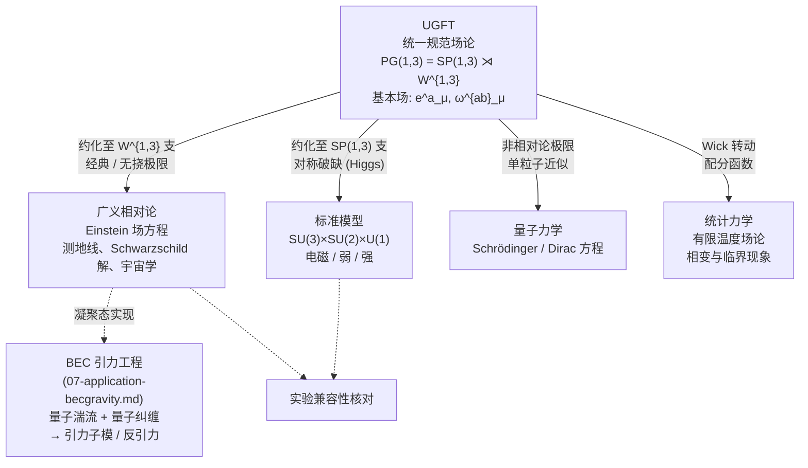

# UGFT 综述：统一规范场论导引

**摘要** —— 本文作为 `docs_ugft/` 目录的单篇入门综述，简明刻画 UGFT (Unified Gauge Field Theory，统一规范场论) 的基本构造、核心场量、规范群结构与统一图景，并给出与主流 TGFT (Tensorial Group Field Theory) 的边界划分。文末附延伸阅读地图，对应目录内各分册的具体推导。

---

## 1. 基本主张

**UGFT** 的核心命题是：自然界四种已知的基本相互作用——引力、电磁、弱、强——可归结为同一个非齐次自旋规范群

$$
PG(1,3)   =   SP(1,3)   \rtimes   W^{1,3}
$$

在时空各点局部成立时所必需引入的规范连接。半积分解中：

- 自旋部分 $SP(1,3)$ （Lorentz-代数式的内禀规范对称性）承载电磁、弱、强相互作用；
- 手征平移部分 $W^{1,3}$ （沿洛伦兹标架的局部平移规范对称性）承载引力。

在此框架下，广义相对论 (GR) 不再独立于量子场论之外：它是 $W^{1,3}$ 规范支在经典与无挠极限下的归约；标准模型 (SM) 是 $SP(1,3)$ 规范支在合适对称破缺下的有效理论；量子力学与统计力学分别对应于非相对论极限与有限温度极限下的退化。整体而言，**已知物理定律可在恰当的极限下从 UGFT 中复原**。

---

## 2. 基本场量

UGFT 的所有动力学建立在以下三个对象之上。

### 2.1 标架场 $e^a_\mu$ （Tetrad / Vierbein）

将局部洛伦兹标架嫁接到时空流形每一点的基本几何量，通过

$$
g_{\mu\nu}   =   e^a_\mu \, e^b_\nu \, \eta_{ab}
$$

构造时空度规 $g_{\mu\nu}$ ，其中 $\eta_{ab} = \mathrm{diag}(-1,1,1,1)$ 为闵可夫斯基度规。拉丁指标 $a,b$ 标记局部洛伦兹标架，希腊指标 $\mu,\nu$ 标记时空坐标。

与传统度规表述相比，标架场把"局部测量基准"提升为独立的基本场，使得在同一框架下同时承载玻色与费米自由度成为可能。

### 2.2 自旋联络 $\omega^{ab}_\mu$ （Spin Connection）

刻画洛伦兹标架沿时空平移的非平凡转动，作为 $SP(1,3)$ 规范支的连接，给出旋量场的协变导数

$$
D_\mu \psi   =   \partial_\mu \psi   +   \tfrac{1}{4}\, \omega^{ab}_\mu \, \gamma_{ab} \, \psi.
$$

对应的曲率二形式即为标架表述下的黎曼曲率：

$$
R^{ab}_{\mu\nu}   =   \partial_\mu \omega^{ab}_\nu - \partial_\nu \omega^{ab}_\mu + \omega^{a}{}_{c\mu}\, \omega^{cb}_\nu - \omega^{a}{}_{c\nu}\, \omega^{cb}_\mu.
$$

### 2.3 规范群 $PG(1,3) = SP(1,3) \rtimes W^{1,3}$

非齐次自旋规范群。半积结构表明 $W^{1,3}$ 为正规子群， $SP(1,3)$ 通过伴随表示作用其上。

| 分支 | 对称性类型 | 承载相互作用 |
|---|---|---|
| $SP(1,3)$ | 自旋（Lorentz-代数式）规范对称性 | 电磁、弱、强 |
| $W^{1,3}$ | 手征平移规范对称性 | 引力 |

值得强调的是，在 UGFT 中引力被诠释为 $W^{1,3}$ 连接场的物理表现，而非时空几何的弯曲效应；后者仅作为低能极限下的等价描述出现。

---

## 3. 统一图景

下图给出 UGFT 与已知物理理论的派生关系：实线表示理论极限上的归约，虚线表示应用与实验验证层。

图中每一条箭头对应 `docs_ugft/` 目录中的一篇分册。

---

## 4. 关键表达式

下列公式仅给出骨架结构，详细推导见对应分册。

### 4.1 总作用量

$$
S_{\mathrm{UGFT}}   =   \int d^4x    e    \Big[
\underbrace{\tfrac{1}{2\kappa}\, R(e,\omega)}_{\text{引力支} (W^{1,3})}
  +  
\underbrace{-\tfrac{1}{4} F^A_{\mu\nu} F^{A\,\mu\nu}}_{\text{自旋规范支} (SP(1,3))}
  +  
\underbrace{\bar\psi\, i\gamma^a e_a^\mu D_\mu \psi}_{\text{费米物质}}
  +  
\underbrace{\mathcal{L}_{\mathrm{Higgs}}}_{\text{对称破缺}}
\Big]
$$

其中 $e = \det(e^a_\mu)$ 替代 $\sqrt{-g}$ 作为标架表述下的体元， $R(e,\omega) = e_a^\mu e_b^\nu R^{ab}_{\mu\nu}$ 为 Palatini 形式的标量曲率。

### 4.2 经典场方程

对四类基本变量分别变分，可导出 UGFT 的耦合场方程组：

| 变分对象 | 所得方程 |
|---|---|
| $e^a_\mu$ | 推广的 Einstein 场方程（无挠极限下退化为标准 GR） |
| $\omega^{ab}_\mu$ | 挠率方程（建立自旋密度与挠率的代数对应） |
| $A^A_\mu$ | 推广的 Yang–Mills 方程 |
| $\psi$ | 弯曲时空中的 Dirac 方程 |

### 4.3 规范变换

- $SP(1,3)$ 变换（参数 $\alpha^{ab}(x)$ 反对称）：

$$
e^a_\mu \to \Lambda^a{}_b(x)\, e^b_\mu, \qquad
\omega^{ab}_\mu \to \Lambda^a{}_c \Lambda^b{}_d \omega^{cd}_\mu - \Lambda^a{}_c \partial_\mu \Lambda^{bc}.
$$

- $W^{1,3}$ 平移变换（参数 $\xi^a(x)$ ）：

$$
e^a_\mu \to e^a_\mu + \partial_\mu \xi^a + \omega^a{}_{b\mu}\, \xi^b.
$$

所有物理可观测量在上述变换下保持不变，构成 UGFT 的内禀规范不变性要求。

### 4.4 量子纠缠的 UGFT 表达

UGFT 的形式体系并不止于经典场论与单粒子量子化——**量子纠缠**这一非定域关联也可以在标架/联络变量下被显式表达。核心结论可归纳为：

| 量子信息量 | UGFT 几何/规范对应 |
|---|---|
| 约化密度矩阵 $\rho_A$ | 沿子区域 $B$ 粘合的欧氏路径积分 |
| 模哈密顿量 $K_A = -\log\rho_A$ | $SP(1,3)$ 自旋规范支的 boost 生成元 |
| 纠缠熵 $S_A$ | $\frac{1}{4 G_N}\int_{\gamma_A} e^{(d-2)}$ ，标架诱导的极小曲面面元 |

纠缠对几何的反作用以"纠缠流密度" $\Sigma^{ab}_\mu$ 出现在标架场方程的右端。详尽推导见 [`01-mathematical-foundations.md`](01-mathematical-foundations.md) §12；具体的凝聚态实现见 [`07-application-becgravity.md`](07-application-becgravity.md) 。

---

## 5. 延伸阅读

按"基础 → 极限归约 → 实验对照 → 工程应用"的逻辑顺序：

1. **数学基础** — [`01-mathematical-foundations.md`](01-mathematical-foundations.md)
   流形、纤维丛、联络、曲率与 $PG(1,3)$ 的代数结构。

2. **归约至 GR** — [`02-general-relativity.md`](02-general-relativity.md)
   由 UGFT 作用量导出 Einstein 场方程、测地线、弱场极限与引力波。

3. **归约至 SM** — [`03-standard-model.md`](03-standard-model.md)
   $SP(1,3)$ 在适当破缺下回收 $SU(3)_C \times SU(2)_L \times U(1)_Y$ ；Higgs 机制赋予质量。

4. **归约至 QM** — [`04-quantum-mechanics.md`](04-quantum-mechanics.md)
   路径积分量子化、非相对论极限、Dirac 方程到 Schrödinger 方程的退化。

5. **归约至统计力学** — [`05-statistical-mechanics.md`](05-statistical-mechanics.md)
   Wick 转动、配分函数、临界指数与有限温度场论。

6. **实验兼容性** — [`06-compatibility-verification.md`](06-compatibility-verification.md)
   将上述推论与已有实验观测值列表对照。

7. **工程应用** — [`07-application-becgravity.md`](07-application-becgravity.md)
   提出基于 BEC 量子湍流与长程量子纠缠拓扑触发 UGFT 相变以实现可定向引力子模（含反引力分支）的原型构想。

辅助文档：

- 目录入口与记号约定 — [`README.md`](README.md)
- 与主流 TGFT 的术语消歧 — [`appendix-tgft-disambiguation.md`](appendix-tgft-disambiguation.md)

---

## 6. 与主流 TGFT 的边界

本仓库的 **UGFT (Unified Gauge Field Theory)** 与同首字母缩写的主流方向 **TGFT (Tensorial Group Field Theory)**——由 Oriti、Rivasseau 等人推动——属于不同研究脉络。两者的对照如下：

| 维度 | 本仓库 UGFT | 主流 TGFT |
|---|---|---|
| 基本场 | 时空流形上的标架场 $e^a_\mu$ 与自旋联络 $\omega^{ab}_\mu$ | 群流形 $G^d$ （如 $SU(2)^d$ ）上的张量化群场 $\phi(g_1,\dots,g_d)$ |
| 形式体系 | Poincaré-规范 / Cartan / Einstein–Cartan 形式 | 张量模型、Boulatov–Ooguri 作用量、spin foam |
| 中心问题 | 在同一规范群下统一描述四种相互作用 | 时空从离散组合数据中涌现；可重整化群流 |
| 几何角色 | 几何由 $e^a_\mu$ 给定（背景独立但保留标架） | 几何并不预先存在，由群场关联函数涌现 |
| 与本仓库关系 | 全部内容 | 仅在 `appendix-tgft-disambiguation.md` 中作为消歧参照 |

简言之：本仓库的 UGFT 旨在"将四种相互作用统一于同一规范群下"，主流 TGFT 旨在"由张量化群场重建时空"——研究对象、形式体系与目标各异。

---

> **导航建议**：进入具体推导，可由 [`01-mathematical-foundations.md`](01-mathematical-foundations.md) 入手；关注实验与工程实现，可直接跳至 [`07-application-becgravity.md`](07-application-becgravity.md)。
