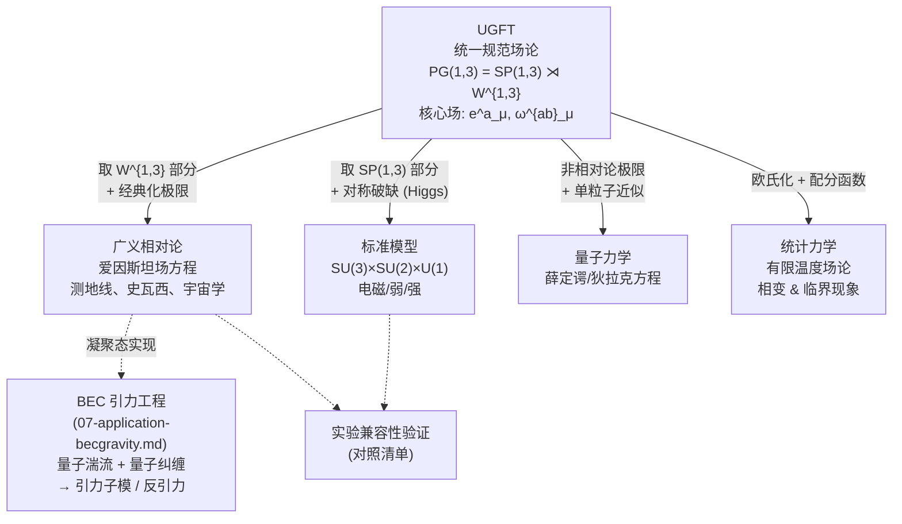

# UGFT 总览：一篇读完就懂统一规范场论

> 本页定位为整个 `docs_ugft/` 目录的**单页入门**。若你只读一篇，就读这篇；要深入哪一块，再去对应的分册。

---

## 1. 核心思想（一段话）

**UGFT (Unified Gauge Field Theory，统一规范场论)** 把自然界的四种基本相互作用——引力、电磁、弱、强——全部解释为**同一个非齐次规范群**

$$
PG(1,3) \;=\; SP(1,3) \;\rtimes\; W^{1,3}
$$

在时空各点**局部成立**所必需引入的规范场。其中：

- 半积的**自旋部分** $SP(1,3)$ （同 Lorentz 群相联系）承载电磁/弱/强相互作用；
- 半积的**手征平移部分** $W^{1,3}$ 承载**引力**。

这就把广义相对论（GR）和标准模型（SM）放进了同一个规范场论框架——GR 不再是几何另开一摊，而是 $W^{1,3}$ 这一支规范理论的低能极限；SM 是 $SP(1,3)$ 那一支在适当破缺下的有效理论；量子力学与统计力学则是这套场论分别在"低速/低粒子数"和"有限温度"下的极限。一句话：**所有已知物理，都是 UGFT 在不同极限下的投影**。

---

## 2. 核心对象（三件套）

UGFT 的所有公式都围绕下面三个对象展开。理解了它们，就理解了 UGFT 的"语言"。

### 2.1 标架场 $e^a_\mu$ （Tetrad / Vierbein）

把"局部洛伦兹标架"贴在每一个时空点上的"四把尺"。它通过

$$
g_{\mu\nu} \;=\; e^a_\mu \, e^b_\nu \, \eta_{ab}
$$

构造出时空度规 $g_{\mu\nu}$ 。这里 $\eta_{ab} = \mathrm{diag}(-1,1,1,1)$ 是闵可夫斯基度规，拉丁指标 $a,b$ 是局部洛伦兹指标，希腊指标 $\mu,\nu$ 是坐标指标。

**直觉**：度规告诉你两点间的距离；标架场告诉你"沿哪个方向量"。把局部测量基准升格为基本场。

### 2.2 自旋联络 $\omega^{ab}_\mu$ （Spin Connection）

告诉你"在时空中平移一个洛伦兹标架时它怎么转"。它是 $SP(1,3)$ 这部分的规范联络，定义协变导数

$$
D_\mu \psi \;=\; \partial_\mu \psi \;+\; \tfrac{1}{4}\, \omega^{ab}_\mu \, \gamma_{ab} \, \psi
$$

让旋量场 $\psi$ 在洛伦兹变换下协变。曲率即是熟悉的黎曼曲率（在标架表示下）：

$$
R^{ab}_{\mu\nu} \;=\; \partial_\mu \omega^{ab}_\nu - \partial_\nu \omega^{ab}_\mu + \omega^{a}{}_{c\mu}\, \omega^{cb}_\nu - \omega^{a}{}_{c\nu}\, \omega^{cb}_\mu
$$

### 2.3 规范群 $PG(1,3) = SP(1,3) \rtimes W^{1,3}$

非齐次自旋规范群。半积符号 $\rtimes$ 表示 $W^{1,3}$ 是正规子群， $SP(1,3)$ 在其上左作用。

| 分支 | 内容 | 对应相互作用 |
|---|---|---|
| $SP(1,3)$ | 自旋规范对称性（Lorentz-like） | 电磁、弱、强 |
| $W^{1,3}$ | 手征平移规范对称性 | **引力** |

**关键点**：在 UGFT 里，引力不是几何弯曲的副产品，而是 $W^{1,3}$ 平移规范的连接场的物理表现——这跟 GR 在底层就不同，但在合适极限下回收到 GR。

---

## 3. 统一图景：从 UGFT 出发的派生路径

虚线表示**应用/验证**层；实线表示**理论极限**层。每条箭头都对应 `docs_ugft/` 里的一个分册。

---

## 4. 关键公式一览

> 所有公式只给"骨架"，详细推导见对应分册。

### 4.1 总作用量（示意）

$$
S_{\mathrm{UGFT}} \;=\; \int d^4x \; e \; \Big[
\underbrace{\tfrac{1}{2\kappa}\, R(e,\omega)}_{\text{引力部分} (W^{1,3})}
\;+\;
\underbrace{-\tfrac{1}{4} F^A_{\mu\nu} F^{A\,\mu\nu}}_{\text{自旋规范场} (SP(1,3))}
\;+\;
\underbrace{\bar\psi\, i\gamma^a e_a^\mu D_\mu \psi}_{\text{物质场}}
\;+\;
\underbrace{\mathcal{L}_{\mathrm{Higgs}}}_{\text{对称破缺}}
\Big]
$$

其中 $e = \det(e^a_\mu)$ 是标架场的行列式（取代了 $\sqrt{-g}$ ）， $R(e,\omega) = e_a^\mu e_b^\nu R^{ab}_{\mu\nu}$ 是 Palatini 形式的标量曲率。

### 4.2 场方程（变分得到）

| 对什么变分 | 得到 |
|---|---|
| 对 $e^a_\mu$ 变分 | 推广的爱因斯坦方程（在无挠极限下回到 GR） |
| 对 $\omega^{ab}_\mu$ 变分 | 挠率方程（联系自旋密度与挠率） |
| 对 $A^A_\mu$ 变分 | 推广的杨-米尔斯方程 |
| 对 $\psi$ 变分 | 弯曲时空中的狄拉克方程 |

### 4.3 规范变换

- $SP(1,3)$ 变换（参数 $\alpha^{ab}(x)$ ，反对称）：

$$
e^a_\mu \to \Lambda^a{}_b(x)\, e^b_\mu, \qquad
\omega^{ab}_\mu \to \Lambda^a{}_c \Lambda^b{}_d \omega^{cd}_\mu - \Lambda^a{}_c \partial_\mu \Lambda^{bc}
$$

- $W^{1,3}$ 平移变换（参数 $\xi^a(x)$ ）：

$$
e^a_\mu \to e^a_\mu + \partial_\mu \xi^a + \omega^a{}_{b\mu}\, \xi^b
$$

**所有物理可观测量在上述变换下都不变**——这是"规范对称性"的核心要求。

---

## 5. 延伸阅读地图

按"先理解、再应用"的顺序：

1. **数学基础** → `01-mathematical-foundations.md`
   流形、纤维丛、联络、曲率、 $PG(1,3)$ 的结构 — 进入下面任何一篇之前的必备工具箱。

2. **回收 GR** → `02-general-relativity.md`
   从 UGFT 作用量出发推爱因斯坦方程、测地线、弱场极限、引力波。

3. **回收 SM** → `03-standard-model.md`
   $SP(1,3)$ 在合适破缺下变为 $SU(3)_C \times SU(2)_L \times U(1)_Y$ ，希格斯机制赋予质量。

4. **回收 QM** → `04-quantum-mechanics.md`
   路径积分量子化、非相对论极限、狄拉克方程到薛定谔方程的下降。

5. **回收统计力学** → `05-statistical-mechanics.md`
   欧氏化、配分函数、临界指数、有限温度场论。

6. **实验对照** → `06-compatibility-verification.md`
   把上面所有推论列成"实验值 vs UGFT 预测"对照表。

7. **工程应用** → `07-application-becgravity.md`
   一个具体设想：用 BEC 量子湍流 + **量子纠缠拓扑**触发 UGFT 相变，产生可定向的引力子模乃至**反引力**。

辅助：

- **索引页** → `README.md`（阅读顺序、记号约定）
- **术语消歧** → `appendix-tgft-disambiguation.md`（与主流 TGFT 的区别）

---

## 6. 与主流 TGFT 的边界

本仓库的 **UGFT (Unified Gauge Field Theory)** 与学术界常用的同首字母缩写 **TGFT (Tensorial Group Field Theory，Oriti / Rivasseau 等人推动)** **完全不是同一脉络**：

| 维度 | 本仓库 UGFT | 主流 TGFT |
|---|---|---|
| 基本场 | 时空上的标架场 $e^a_\mu$ 、自旋联络 $\omega^{ab}_\mu$ | 群流形 $G^d$ （如 $SU(2)^d$ ）上的张量化群场 $\phi(g_1,\dots,g_d)$ |
| 出发点 | Poincaré-规范 / Cartan / Einstein-Cartan 形式 | 张量模型、Boulatov-Ooguri 作用量、spin foam |
| 中心问题 | 把四种相互作用塞进同一个规范群 | 时空从离散组合数据中**涌现**；可重整化 |
| 几何角色 | 几何由 $e^a_\mu$ 给定（背景独立但有标架） | 几何**事先不存在**，由群场的关联函数涌现 |
| 与本仓库关系 | 本仓库的全部内容 | 仅在 `appendix-tgft-disambiguation.md` 里被引用以做消歧 |

**记住一句话**：本仓库的 UGFT 是 "Poincaré-规范引力 + 标准模型放进同一个群"，主流 TGFT 是 "用张量模型/群场重建时空"。两者的研究对象、形式体系、最终目标都不相同。

---

> **下一步**：如果你刚读完这页想动手算点东西，从 `01-mathematical-foundations.md` 开始；如果你想看 UGFT 在工程上能做什么疯狂的事，跳到 `07-application-becgravity.md`。
