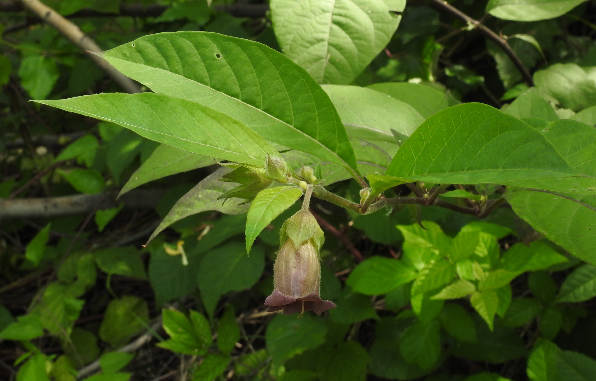
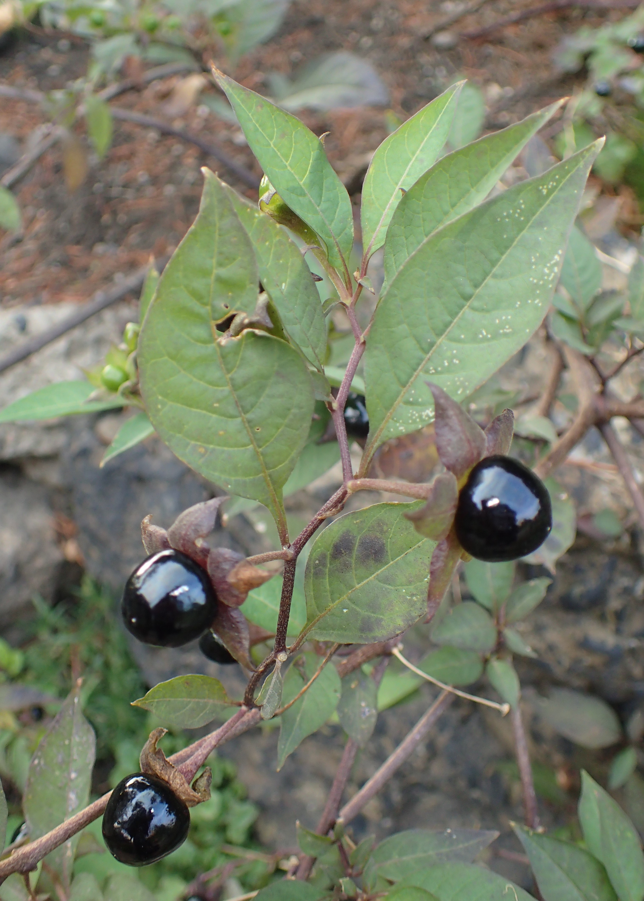
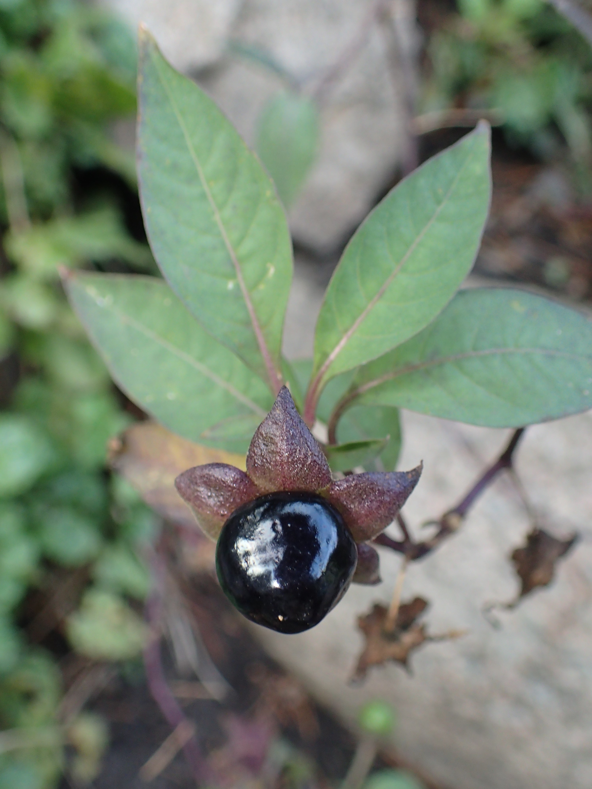
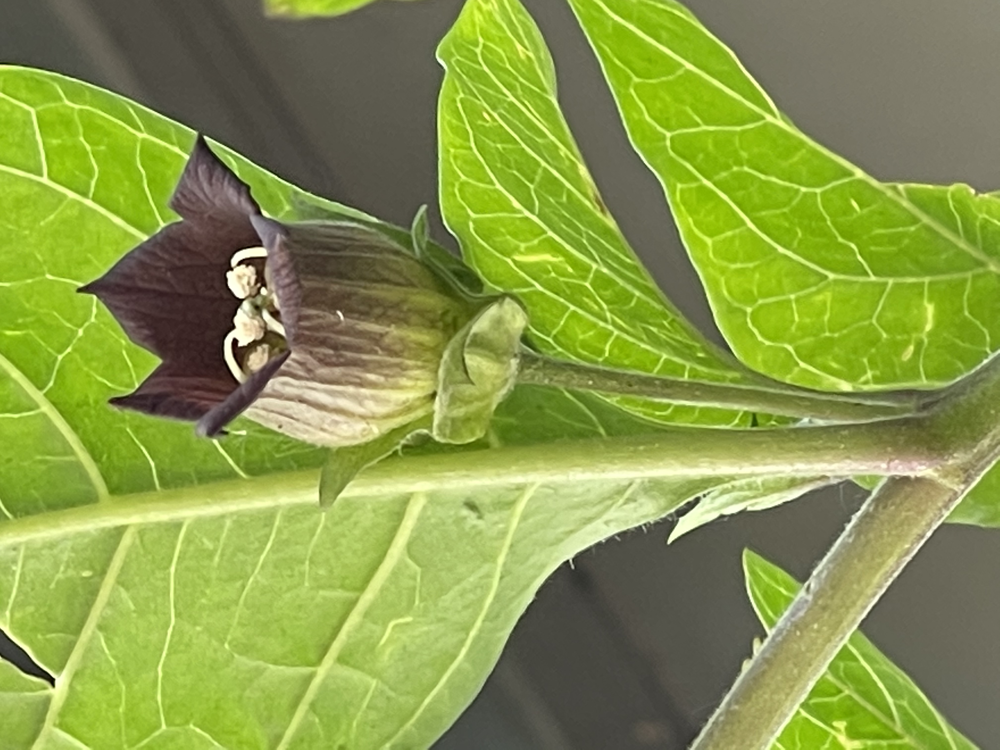
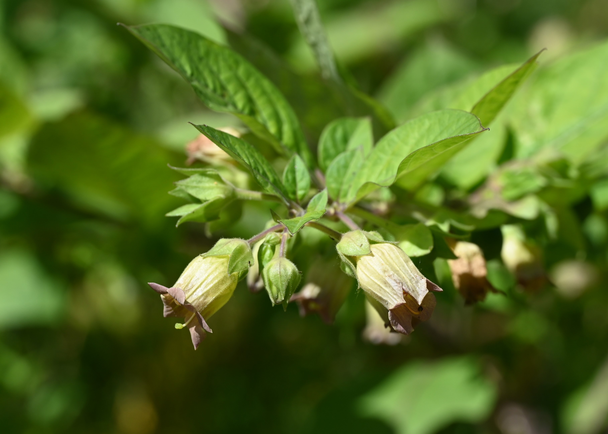

# 颠茄 | Belladonna/Deadly Nightshade | *Atropa belladonna*

*Belladonna plant (*Atropa belladonna*) growing in its natural woodland habitat*

| 属性 | 内容 |
|------|------|
| 中文名 | 颠茄 |
| 英文名 | Belladonna/Deadly Nightshade |
| 学名 | *Atropa belladonna* |
| 分类 | 不可食用 |
| 可食部位/毒部位 | 毒部位: all parts, especially berries |
| 关键特征 | 多年生草本；卵形叶片、紫褐色钟形花、黑色毒性浆果。 |
| 种植难度 | 中等（喜阴湿石灰地） |

## 1. 形态与识别要点

*Belladonna showing characteristic ovate leaves and purple bell-shaped flowers*

颠茄（Atropa belladonna）为茄科颠茄属多年生草本植物，原产欧洲、北非和西亚。植株高度可达0.5-1.5米，具有粗壮的地下根茂。舔直立，上部分枝，表面光滑或微有柔毛。叶片互生，卵形至椭圆形，长5-20厘米，宽2.5-10厘米，先端急尖，基部尖端，全缘，表面暗绿色，背面较淡，质地较薄但有韧性。轻揉叶片会散发不快的气味。

花单生或成对生于叶腋，花棗下垂，花冠钟形，长1.5-3厘米，外面绿色或紫褐色，内面淡紫色或黄绿色，具有紫色网纹。雄蕊5枚，附着在花冠筒上。果实为浆果，球形，直径1-2厘米，成熟时呈亮黑色，光滑有光泽，内含多数小种子。此果实外观鲜艳诱人但剧毒。

### 与相似种的区别

*Critical identification: Belladonna berries (left) vs safe elderberries (right) - note the glossy black appearance and single berry attachment*

**与老鸦草（Sambucus canadensis）区分**：老鸦草的果实成簇生长，而颠茄果实单个生长。老鸦草叶片为羽状复叶，颠茄为单叶。**与黑马士樱桃（Prunus serotina）区分**：黑马士樱桃果实小且成串生长，叶片具齿缘。**与夜香（Solanum dulcamara）区分**：夜香果实红色，植株蔓性，花紫色但较小。

**关键警告**：颠茄的所有部位都有剧毒，特别是果实。绝对不要尝试食用任何部位，即使是少量也可能致命。

## 2. 种植技巧

*Belladonna thriving in its preferred woodland habitat with dappled shade*

- **气候区域**: USDA 6-9
- **光照需求**: partial shade to full shade
- **土壤要求**: well-drained, calcareous, humus-rich soil
- **pH值**: 6.5-7.5
- **浇水**: 保持土壤湿润但不积水，干旱期适度浇水。
- **施肥**: 有机肥料，春季施用低氮肥料
- **繁殖方式**: seed, root division
- **病虫害防治**: aphids, spider mites, fungal leaf spots
- **伴生建议**: 不建议伴生，由于其剧毒性应单独种植

## 3. 常见品种

*Highly toxic belladonna berries - shiny black and extremely dangerous*

- **Wild Belladonna (Atropa belladonna)**：原生种，分布于欧洲森林和荒地，毒性最强。叶片较大，果实黑亮。
- **Atropa belladonna var. lutea**：黄色果实变种，极罕见，毒性与原种相同。
- **Cultivated forms**：主要用于科学研究和药物生产，严格控制栽培。

**重要警告**：所有颠茄品种都具有剧毒性，不应该被普通人栽埴。即使是科学研究用途，也需要专业许可和安全措施。

## 4. 化学成分与风味

颠茄的毒性成分主要为托品烷生物碱（tropane alkaloids），主要包括：
- **阿托品（Atropine）**：含量0.2-0.6%，是主要的毒性成分，对副交感神经系统产生强烈抑制作用。
- **东莓菪碱（Scopolamine）**：含量0.1-0.5%，更容易穿过血脑屏障，对中枢神经系统影响更大。
- **天仙子胺（Hyoscyamine）**：阿托品的左旋异构体，毒性更强。

这些生物碱主要集中在果实、种子和根部，但叶片和花中也有显著含量。这些化合物没有明显的味道，这使得颠茄中毒更加危险。

## 5. 用法与搭配（仅可食用类）

**绝对禁止使用**：颠茄所有部位均具有剧毒性，绝对不可食用或用于任何形式的家庭疗法。即使是少量接触也可能导致严重后果。

在古代，颠茄曾被误用于“美容”（散大瞳孔）和“安眠”，但这些用法都已被现代医学证实是极其危险的。现代制药工业仅在严格控制下提取其有效成分用于特定药物。

### 保存方法

**不应该保存**：由于极端危险性，不应该在家庭中保存或干燥颠茄。如果必须处理（如科学研究），必须使用专业防护设备和安全措施。

## 6. 毒理与禁忌

*Warning signs like this should always be heeded - belladonna is among the most dangerous plants*

颠茄的毒理学机制与其含有的托品烷生物碱密切相关。这些化合物的分子结构使其能够竞争性地结合到毒蕈碱受体上，阻断乙酰胆碱的正常作用，从而产生广泛的抗胆碱能效应。阿托品是消旋体，包含等量的右旋阿托品和左旋天仙子胺，而天仙子胺是纯的左旋异构体，药理活性约为阿托品的两倍。东莨菪碱则更容易通过血脑屏障，对中枢神经系统的影响更为显著。

这些生物碱的药代动力学特点是吸收迅速而广泛。口服后30-60分钟开始出现症状，1-2小时达到峰效应。毒素迅速分布到全身各组织，特别是富有胆碱能受体的器官如心脏、眼部、胃肠道和中枢神经系统。代谢主要在肝脏进行，通过水解和结合反应，代谢产物经肾脏排泄。阿托品的半衰期约为2-3小时，但其作用可持续4-6小时甚至更长。

毒理机制的具体表现：
1. 心血管系统：阻断心脏的迷走神经支配，导致心率显著增加，可达120-160次/分钟，心律可能不规则，血压通常升高。严重中毒时可出现心律失常，包括室性心律失常，这是致死的主要原因之一。

2. 中枢神经系统：东莨菪碱能穿过血脑屏障，导致中枢神经系统兴奋，表现为躁动、幻觉、妄想、定向障碍。随着中毒加深，可能出现抽搐、昏迷。特征性的症状是患者会出现生动的幻觉，通常是视觉幻觉，如看到不存在的人或动物。

3. 自主神经系统：阻断副交感神经，导致口干、吞咽困难、声音嘶哑、皮肤干燥、无汗、体温升高。瞳孔显著散大并对光反射消失，视力模糊，畏光。胃肠道蠕动减慢，可能出现便秘和尿潴留。

4. 呼吸系统：支气管平滑肌松弛，但严重中毒时由于中枢神经抑制可能导致呼吸衰竭。

致死剂量个体差异很大，儿童的敏感性远高于成人。致死机制主要包括：心律失常导致的心脏骤停、呼吸中枢抑制导致的呼吸衰竭、严重脱水和电解质紊乱、高热导致的多器官功能衰竭。

需要注意的是，颠茄中毒的症状可能波动，患者可能在清醒和谵妄状态之间交替。这种特点使得病情评估和治疗变得更加复杂。

## 7. 参考资料

- [Assessment report on Atropa belladonna L., herba and radix](https://www.ema.europa.eu/en/documents/herbal-report/final-assessment-report-atropa-belladonna-l-herba-radix_en.pdf) — European Medicines Agency, 2016
- [A Modern Herbal: Belladonna](https://botanical.com/botanical/mgmh/n/nighde06.html) — Botanical.com, 2021
- [Tropane alkaloid poisoning: diagnosis and management](https://www.tandfonline.com/doi/full/10.1080/15563650.2019.1606432) — Clinical Toxicology, 2019
- [Belladonna (Atropa belladonna): A poisonous plant of therapeutic value](https://www.apjtb.org/article.asp?issn=2221-1691) — Asian Pacific Journal of Tropical Biomedicine, 2020

---
*声明：本信息仅供参考，不替代专业医疗建议。*

## Local Image Gallery

*Downloaded high-resolution images for offline viewing:*

*Image 1: © Robert Flogaus-Faust (CC BY 4.0)*

*Image 2: © Krzysztof Ziarnek, Kenraiz (CC BY-SA 4.0)*

*Image 3: © Krzysztof Ziarnek, Kenraiz (CC BY-SA 4.0)*

*Image 4: © Flobbadob (CC BY-SA 4.0)*

*Image 5: © Krzysztof Ziarnek, Kenraiz (CC BY-SA 4.0)*
