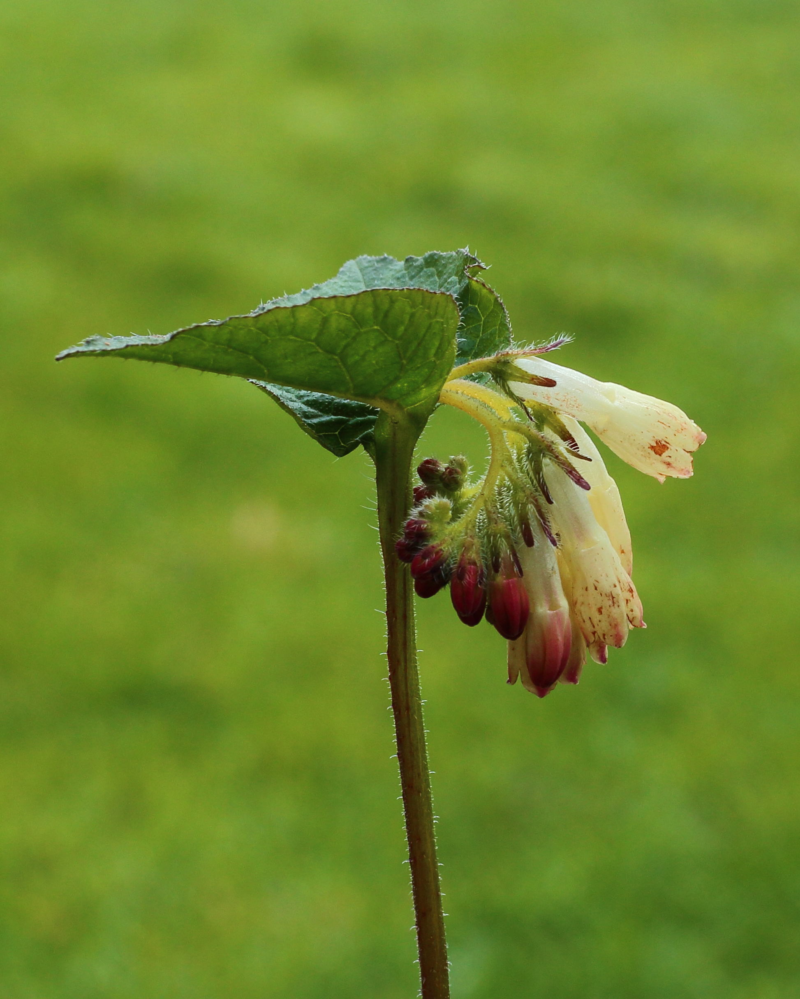
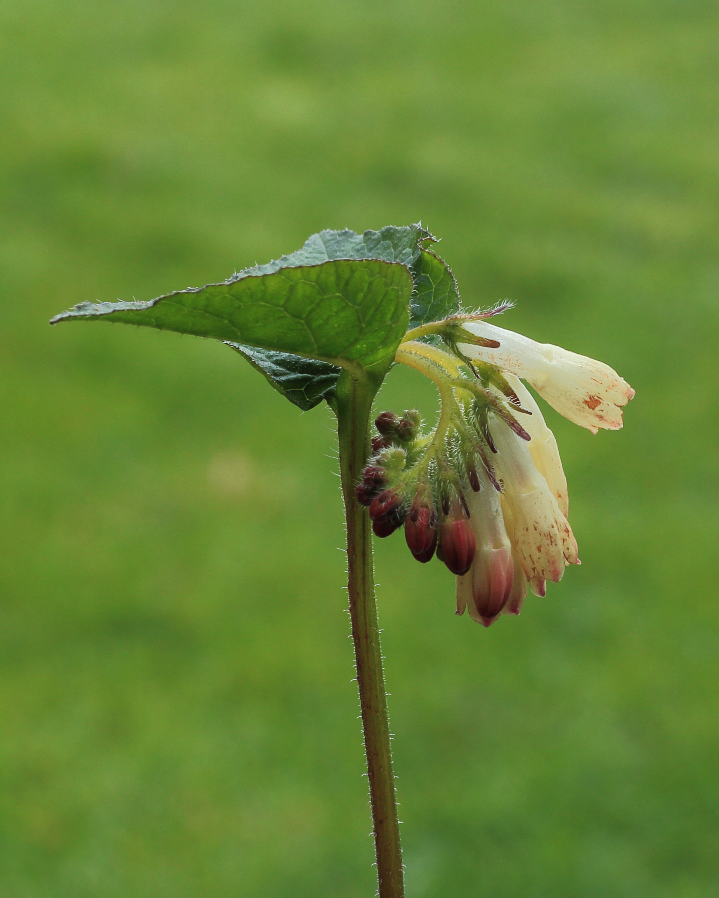
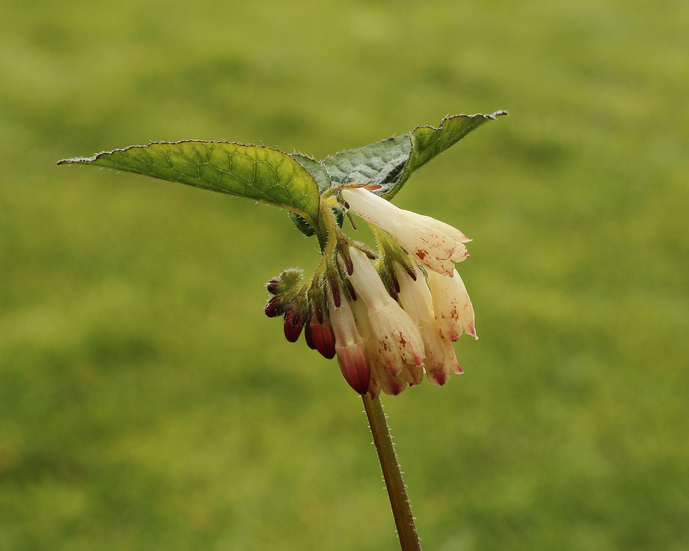
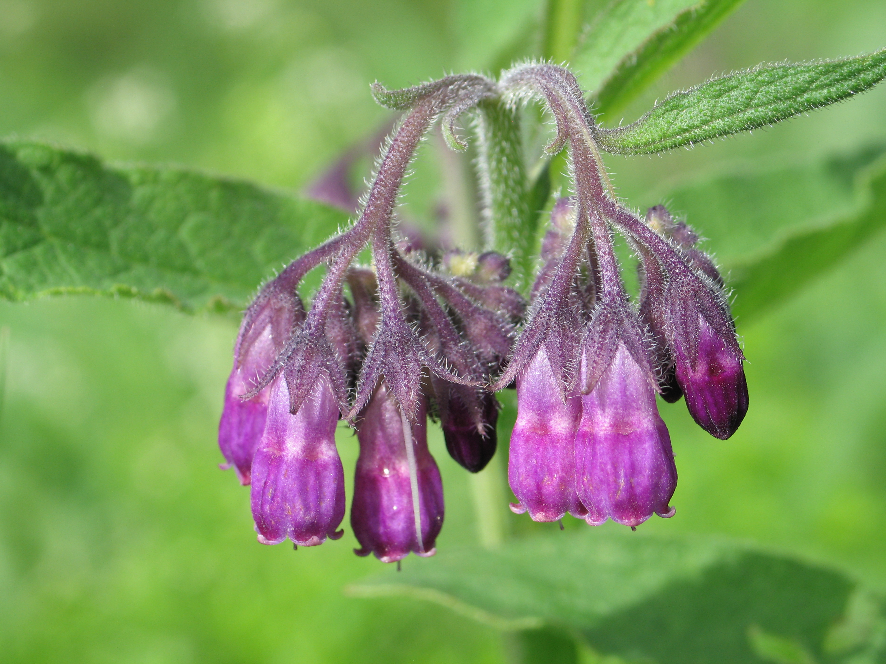

# 紫草 | Comfrey | *Symphytum officinale*

*Comfrey plant showing characteristic large hairy leaves and robust growth habit*

| 属性 | 内容 |
|------|------|
| 中文名 | 紫草 |
| 英文名 | Comfrey |
| 学名 | *Symphytum officinale* |
| 分类 | 不可食用 |
| 可食部位/毒部位 | 毒部位: roots, leaves, stems, flowers |
| 关键特征 | 多年生草本；粗糙多毛叶片、钟状下垂花序；含剧毒吡咯里西啶生物碱，曾误用作药草现已禁用。 |
| 种植难度 | 容易（但不建议种植） |

## 1. 形态与识别要点

*Close-up of comfrey leaves showing the characteristic rough, hairy texture and large size*

紫草（Symphytum officinale）为紫草科聚合草属多年生草本植物，株高通常60-120厘米，在适宜环境下可达150厘米。植株具深根系统，主根粗壮肉质，深入土层可达2-3米，使其具有极强的抗旱能力。茎直立，粗壮多汁，表面被粗糙硬毛，基部直径可达2-3厘米。

叶片是识别紫草的关键特征：互生，大型，长椭圆形至披针形，长10-30厘米，宽3-10厘米，两面均被粗糙硬毛，触感明显刺手。叶面深绿色，叶背较浅，叶脉明显凸起。下部叶片具柄，上部叶片无柄且抱茎。

*Comfrey bell-shaped flowers in clusters, typically purple, pink, or white*

花序为顶生或腋生的蝎尾状聚伞花序，花朵钟状下垂，长12-18毫米，花冠通常为紫色、粉红色或白色，5裂，花期5-9月。花朵形态独特，是重要的识别特征。果实为4枚小坚果，黑色光滑，三角形，长约3-4毫米。

整个植株被粗糙硬毛覆盖，这种硬毛质感是与其他植物区分的重要特征。根部断面呈白色或淡黄色，含有大量黏液质，传统上被误认为具有"愈合"功效，但现代毒理学研究证实其严重毒性。

### 与相似种的区别

*Comfrey's characteristic thick, fleshy taproot - contains the highest concentration of toxic alkaloids*

与琉璃苣（Borago officinalis）区分：琉璃苣叶片更圆钝，表面毛被更软，花朵星状蓝色；紫草叶片长椭圆形，毛被粗糙刺手，花朵钟状下垂。与牛舌草（Anchusa officinalis）区分：牛舌草叶片更窄，花朵平展开放成漏斗状；紫草叶片宽大，花朵下垂钟状。与毛蕊花（Verbascum thapsus）区分：毛蕊花叶片被白色绒毛，质地柔软，开黄色穗状花序；紫草被粗硬毛，钟状花序。

*Comfrey growing in its natural habitat - often found in moist, fertile areas near streams*

## 2. 种植技巧

⚠️ **重要警告：不建议种植紫草，特别是在有儿童或宠物的环境中，因其全株剧毒。**

- **气候区域**: USDA 3-9
- **光照需求**: full sun to partial shade  
- **土壤要求**: moist, fertile, well-drained soil
- **pH值**: 6.0-7.5
- **浇水**: 喜湿润土壤，但避免积水；深根系使其耐旱性较强
- **施肥**: 无需施肥，在贫瘠土壤也能生长
- **繁殖方式**: root division, seed, root cuttings
- **病虫害防治**: 很少有病虫害，植株极其健壮
- **伴生建议**: 不建议与任何食用植物伴生

## 3. 常见品种

**Common Comfrey（普通紫草）**：最常见的野生种，紫色花朵，毒性最强，含剧毒生物碱浓度最高。

**White Comfrey（白花紫草）**：花朵为白色的变种，毒性与普通紫草相同，观赏价值较高但同样危险。

**Russian Comfrey（Symphytum × uplandicum）**：普通紫草与刺毛紫草的杂交种，叶片更大，生长更旺盛，毒性同样严重。

**Dwarf Comfrey（矮生紫草）**：株型较小的园艺品种，但毒性并未降低，仍然极其危险。

## 4. 化学成分与风味

⚠️ **严重毒性警告**：紫草含有多种剧毒吡咯里西啶生物碱，所有部位均不可食用，不可用作任何用途。

紫草不应被用于任何烹饪或药用目的，其化学成分已被证实对人体具有严重毒性。

## 5. 用法与搭配（仅可食用类）

⚠️ **绝对禁止**：紫草全株剧毒，严禁任何形式的食用或药用。曾有历史误用记录，但现代科学已证实其极度危险性。

### 保存方法

**不适用**：由于紫草的剧毒性，不应进行任何形式的保存或处理。

## 6. 毒理与禁忌

**⚠️ 严重毒性警告：紫草全株剧毒，严禁任何接触、食用或药用！⚠️**

紫草的毒理学特性主要由其含有的吡咯里西啶生物碱（PAs）决定，这是一大类结构相似的天然化合物，在植物界中广泛存在，特别是在紫草科、菊科和豆科植物中。紫草中的主要PAs包括中间型生物碱（intermedine）、李可宁（lycopsamine）、回声宁（echimidine）、聚合草碱（symphytine）和其他相关化合物。

分子结构和分类：
PAs的基本结构包含一个双羟基吡咯里西啶环（necine base）和一个或两个脂肪酸侧链（necic acid）。根据necine base的结构，PAs可分为多个类型，其中1,2-不饱和PAs（如中间型生物碱和李可宁）是最毒的类型，因为它们能够被代谢为反应性代谢产物。相比之下，饱和PAs（如聚合草碱的某些异构体）毒性相对较低，但仍不能认为是安全的。

代谢激活机制：
PAs本身相对无毒，但它们在肝脏中的代谢过程产生了高度毒性的中间体。代谢主要通过两个途径进行：

1. 细胞色素P450途径：主要由CYP3A和CYP2B1酶催化，PAs被氧化形成吡咯类化合物（pyrroles）。这些吡咯类化合物是强烈的亲电试剂，能够与细胞内的亲核基团发生不可逆结合。

2. 水解途径：某些PAs可以被酯酶水解，产生necine base，但这种途径产生的毒性相对较轻。

毒性作用机制：
吡咯类代谢产物的毒性机制是多方面的：

1. DNA损害：吡咯类化合物与DNA形成加合物，导致DNA链断裂、突变和染色体异常。这种DNA损害是PAs致癌性的主要机制。

2. 蛋白质交联：吡咯类化合物与蛋白质中的氨基、巯基等基团结合，导致蛋白质功能丧失和细胞结构破坏。

3. 脂质过氧化：通过产生自由基引发脂质过氧化，导致细胞膜损伤和细胞死亡。

4. 谷胱甘肽耗竭：大量消耗细胞内的谷胱甘肽，削弱细胞的抗氧化防御系统。

肝脏毒性的病理过程：
PAs引起的肝脏损害有特征性的病理变化：

1. 肝静脉闭塞症（VOD）：这是PAs中毒最特征性的表现，肝窦内皮细胞肿胀和坏死，导致肝窦阻塞和门静脉高压。VOD可以是急性的，表现为腹水、黄疸和肝肿大，也可以是慢性的，逐渐发展为肝硬化。

2. 肝细胞坏死：主要影响肝小叶的中央区域，表现为肝细胞巨核化、细胞肿胀和坏死。

3. 纤维化和硬化：慢性损害导致肝脏纤维化，最终发展为肝硬化。纤维化主要从门静脉区开始，逐渐扩展到整个肝小叶。

4. 恶性转化：长期暴露于PAs可能导致肝细胞癌，这可能与DNA损害和慢性炎症有关。

肺脏毒性机制：
PAs除了对肝脏的损害外，还可能对肺脏造成特异性损伤：

1. 肺动脉内膜增厚：PAs代谢产物损害肺动脉内皮细胞，导致内膜增生和管腔狭窄。

2. 肺动脉高压：管腔狭窄导致肺血管阻力增加，发展为肺动脉高压。

3. 右心衰竭：持续的肺动脉高压最终导致右心室肥厚和功能不全。

4. 肺纤维化：在某些情况下，PAs可能引起肺间质纤维化。

其他系统毒性：

1. 肾脏：可能导致肾小球硬化和肾功能不全。

2. 中枢神经系统：高剂量时可能引起脑水肿和神经功能障碍。

3. 胃肠道：可能引起胃肠道出血和溃疡。

4. 心血管系统：除肺动脉高压外，可能影响心肌功能。

药代动力学特征：
PAs口服后迅速吸收，生物利用度约60-80%。吸收后迅速分布到各个器官，特别是肝脏。由于PAs具有相对较强的极性，它们不容易穿过血脑屏障，但在肝脏中浓缩。

代谢主要在肝脏进行，半衰期约2-6小时，但毒性代谢产物可能在组织中持续存在更长时间。排泄主要通过肾脏，约50-70%以原形和代谢产物形式从尿液中排出。

毒性的累积性：
PAs毒性的一个重要特点是累积性。即使是低剂量的长期暴露也可能导致严重的健康问题。这种累积效应可能与以下因素有关：

1. 代谢产物的持续损害：吡咯类代谢产物与生物大分子形成的共价结合是不可逆的。

2. 修复能力有限：肝脏对PAs引起的特异性损害（如VOD）的修复能力有限。

3. 慢性炎症：持续的细胞损害引起慢性炎症反应，加重组织损伤。

个体差异：
PAs毒性存在显著的个体差异：

1. 遗传因素：细胞色素P450酶的遗传多态性影响PAs的代谢速度。

2. 年龄：儿童和老年人更容易受到PAs的毒害。

3. 性别：某些研究显示女性对PAs的敏感性可能更高。

4. 营养状态：蛋白质营养不良可能增加PAs毒性。

5. 并存疾病：既往肝病患者风险更高。

6. 药物相互作用：某些药物可能影响PAs的代谢。

致癌性：
PAs被国际癌症研究机构（IARC）列为2B类致癌物（可能对人类致癌）。致癌机制主要包括：

1. 遗传毒性：DNA加合物形成和染色体损伤。

2. 表观遗传学改变：DNA甲基化模式的改变。

3. 慢性炎症：持续的组织损伤和修复过程。

4. 氧化应激：自由基的产生和抗氧化系统的耗竭。

流行病学研究显示，长期摄入含PAs植物的人群肝癌发病率显著增加，特别是在一些传统使用这类植物的地区。

安全阈值：
由于PAs的致癌性和累积毒性，目前认为不存在绝对安全的暴露水平。欧洲食品安全局（EFSA）建议PAs的每日摄入量应尽可能低，临时耐受摄入量为0.007 μg/kg体重/天，这个水平仍然存在一定的健康风险。

对于紫草这样的高PAs含量植物，即使是传统的'治疗剂量'也远远超过了安全限值，因此现代医学完全不建议其内服使用。

## 7. 参考资料

- [Risks for human health related to the presence of pyrrolizidine alkaloids in honey, tea, herbal infusions and food supplements](https://efsa.onlinelibrary.wiley.com/doi/epdf/10.2903/j.efsa.2017.4908) — European Food Safety Authority, 2017
- [WHO monographs on medicinal plants commonly used in the Newly Independent States (NIS)](https://apps.who.int/iris/handle/10665/44426) — World Health Organization, 2010
- [Pyrrolizidine alkaloids in comfrey: toxic or medicinal?](https://www.sciencedirect.com/science/article/pii/S0378874119314012) — Journal of Ethnopharmacology, 2019
- [Hepatic veno-occlusive disease due to pyrrolizidine alkaloid toxicity](https://www.tandfonline.com/doi/full/10.1080/15563650.2018.1456055) — Clinical Toxicology, 2018
- [Safety assessment of pyrrolizidine alkaloids in food](https://efsa.onlinelibrary.wiley.com/doi/epdf/10.2903/j.efsa.2016.4572) — EFSA Panel on Contaminants in the Food Chain, 2016

---
*声明：本信息仅供参考，不替代专业医疗建议。*

## Local Image Gallery

*Downloaded high-resolution images for offline viewing:*

*Image 1: © Dominicus Johannes Bergsma (CC BY-SA 3.0)*

*Image 2: © Dominicus Johannes Bergsma (CC BY-SA 3.0)*

*Image 3: © Dominicus Johannes Bergsma (CC BY-SA 3.0)*

*Image 4: © Reinhold Möller Ermell (CC BY-SA 4.0)*

*Image 5: © Robert Flogaus-Faust (CC BY 4.0)*
