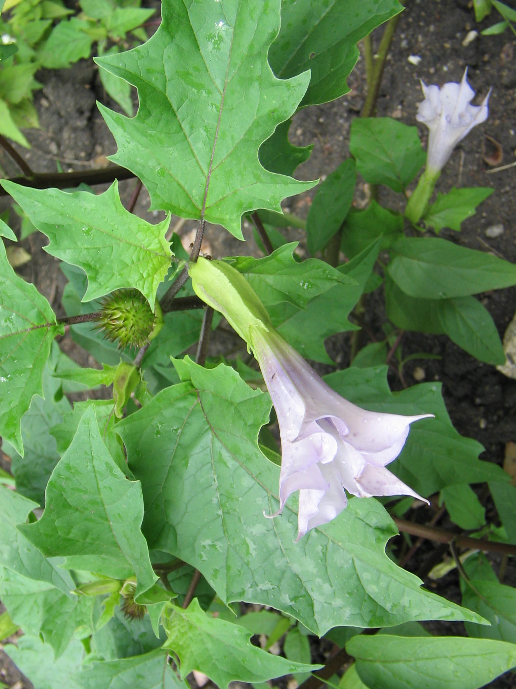

# 曼陀罗 | Datura/Jimsonweed | *Datura stramonium*

*Datura stramonium whole plant showing robust bushy growth - extremely dangerous and poisonous*

⚠️ **极度危险警告：曼陀罗全株剧毒，可致死，严禁接触或种植！** ⚠️

| 属性 | 内容 |
|------|------|
| 中文名 | 曼陀罗 |
| 英文名 | Datura/Jimsonweed |
| 学名 | *Datura stramonium* |
| 分类 | 不可食用 |
| 可食部位/毒部位 | 毒部位: ALL PARTS - leaves, flowers, stems, seeds, roots |
| 关键特征 | 一年生草本；大型齿缘叶片、白色喇叭状花朵、带刺蒴果；含剧毒托品烷生物碱，极易致死。 |
| 种植难度 | 极易生长（但严禁种植） |

## 1. 形态与识别要点

*Datura leaves showing the characteristic large, irregularly toothed margins*

曼陀罗（Datura stramonium）为茄科曼陀罗属一年生草本植物，株高通常60-150厘米，在适宜条件下可达200厘米以上。植株呈直立灌丛状，分枝繁多，茎秆粗壮，绿色或带紫色斑纹，表面光滑，中空。

叶片互生，大型，卵形至椭圆形，长8-20厘米，宽6-15厘米，叶缘具不规则的深齿裂或浅裂，齿尖锐利。叶面深绿色，叶背稍淡，两面均无毛或被稀疏短毛，叶脉明显。叶柄长2-8厘米，粗壮。

*Large white trumpet-shaped flowers of Datura - beautiful but deadly*

花朵极具观赏性但极度危险：单生于叶腋或枝端，大型，漏斗状，长6-10厘米，直径4-6厘米，通常为纯白色，偶有淡紫色品种。花冠5裂，裂片三角形且先端尖锐。花期7-10月，夜间开花，散发浓郁香气吸引夜行性昆虫传粉，但这种香气对人类而言极其危险。

*Characteristic spiny seed capsules of Datura - containing highly toxic seeds*

果实为蒴果，卵形或椭圆形，长3-5厘米，表面密被硬刺，成熟时4瓣开裂。种子黑色，肾形，表面粗糙，含毒性最高。每个果实含种子数百粒，传播能力极强，这也是曼陀罗成为世界性毒草的原因之一。

根系为直根系，主根粗壮深长，侧根发达，适应能力极强，即使在贫瘠土壤中也能茁壮生长。全株散发特殊气味，类似番茄叶片但更加刺鼻。

### 与相似种的区别

*Warning: Datura can quickly spread and infest agricultural areas - always dangerous*

与茄子幼苗区分：茄子叶片椭圆形，边缘光滑或仅有浅齿，花朵紫色较小；曼陀罗叶片具深锐齿，花朵大型白色喇叭状。与番茄区分：番茄叶片羽状复叶，有特殊番茄气味，花朵黄色小型；曼陀罗单叶大型，气味刺鼻，花朵白色巨大。与颠茄区分：颠茄为多年生灌木状，叶片卵形全缘，花朵紫褐色钟状，浆果状果实；曼陀罗一年生草本，叶片有齿，白色喇叭花，刺果。

## 2. 种植技巧

⚠️ **严禁种植警告：曼陀罗传播迅速，毒性极强，严禁任何形式的种植、栽培或保存！**

- **气候区域**: USDA 4-11（但严禁种植）
- **光照需求**: full sun to partial shade
- **土壤要求**: 适应性极强，几乎任何土壤都能生长
- **pH值**: 5.0-8.0
- **浇水**: 极耐旱，几乎不需要额外浇水
- **施肥**: 无需施肥，在贫瘠土壤中生长更旺盛
- **繁殖方式**: seed（传播极快极危险）
- **病虫害防治**: 几乎无病虫害，因植株本身剧毒
- **伴生建议**: 严禁与任何植物伴生

## 3. 常见品种

⚠️ **所有曼陀罗品种均剧毒致死，严禁接触！**

**Datura stramonium（普通曼陀罗）**：最常见也是毒性最强的种类，白花，全世界广泛分布，是最危险的品种。

**Datura tatula（紫花曼陀罗）**：花朵淡紫色，毒性与白花种相同，同样极度危险。

**Datura innoxia（毛曼陀罗）**：叶片被毛，花朵更大，毒性极强，在美国西南部常见。

**Datura metel（洋金花）**：观赏品种，花朵重瓣，毒性不减，极度危险。

## 4. 化学成分与风味

⚠️ **剧毒成分警告：曼陀罗含极毒托品烷生物碱，微量即可致死！**

曼陀罗含有多种剧毒托品烷生物碱，主要包括阿托品、东莨菪碱、天仙子胺等，这些化合物对神经系统具有极强毒性，能导致幻觉、昏迷和死亡。

## 5. 用法与搭配（仅可食用类）

⚠️ **绝对禁止**：曼陀罗全株剧毒，严禁任何形式的食用、药用或其他用途。历史上的任何用途记录都是极其危险和错误的。

### 保存方法

**严禁保存**：发现曼陀罗应立即清除并安全处置，严禁保存任何部位。

## 6. 毒理与禁忌

**⚠️ 极度危险：曼陀罗剧毒致死，接触即危险！⚠️**

曼陀罗的毒理学特征极其复杂且危险。植物含有的托品烷生物碱是天然的毒蕈碱受体拮抗剂，主要作用于中枢和外周神经系统。阿托品主要影响外周神经系统，导致副交感神经阻断，表现为瞳孔散大、心率加快、口干、皮肤干燥发热等症状。东莨菪碱则更容易穿过血脑屏障，对中央神经系统产生强烈影响，导致严重的精神症状包括幻觉、妄想、兴奋和昏迷。天仙子胺的作用介于两者之间。

这些生物碱的药代动力学特点是吸收快速但代谢缓慢，半衰期长达13-38小时，这意味着中毒症状可能持续数天。口服后30-60分钟开始显效，2-4小时达到峰效应。毒素主要通过肝脏代谢，肾脏排泄，但由于代谢缓慢，体内蓄积效应明显。

致死机制主要包括：1）中枢神经系统抑制导致呼吸衰竭；2）严重脱水和电解质紊乱；3）体温调节失常导致的高热；4）心律失常；5）由于幻觉和意识障碍导致的意外伤害。特别需要注意的是，曼陀罗中毒与其他药物中毒的重要区别在于患者会出现完全的现实感丧失，无法区分幻觉与现实，这使得患者极易发生跳楼、交通事故等致命意外。

不同部位的毒性浓度差异显著：种子含量最高（0.2-0.4%），其次是叶片（0.2-0.5%），花朵（0.1-0.2%），茎干最低但仍有毒性。即使是干燥的植物材料也保持毒性，储存多年后仍然危险。

## 7. 参考资料

- [Brugmansia and Datura: Angel's Trumpets and Thorn Apples](https://www.fireflybooks.com/brugmansia-and-datura) — Firefly Books, 2002
- [A review on the pharmacology and toxicology of Datura stramonium L.](https://www.sciencedirect.com/science/article/pii/S2095496413600929) — Journal of Integrative Medicine, 2013
- [Tropane alkaloids: chemistry, pharmacology, biosynthesis and production](https://link.springer.com/article/10.1007/s11101-016-9477-x) — Phytochemistry Reviews, 2016
- [Clinical management of Datura stramonium poisoning](https://emj.bmj.com/content/35/12/731) — Emergency Medicine Journal, 2018

---
*声明：本信息仅供参考，不替代专业医疗建议。*

## Local Image Gallery

*Downloaded high-resolution images for offline viewing:*

*Image 1: © No machine-readable author provided. Taka assumed (based on copyright claims). (CC BY-SA 3.0)*

*Image 2: © Didier Descouens (CC BY-SA 3.0)*

*Image 3: © Velvet (CC BY-SA 4.0)*

*Image 4: © Velvet (CC BY-SA 4.0)*
