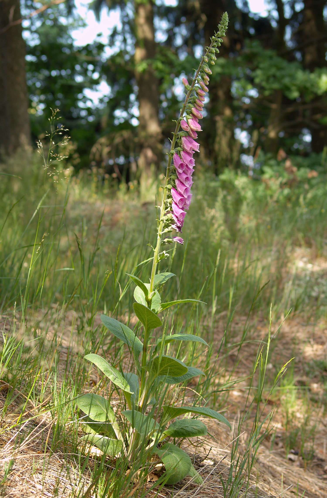
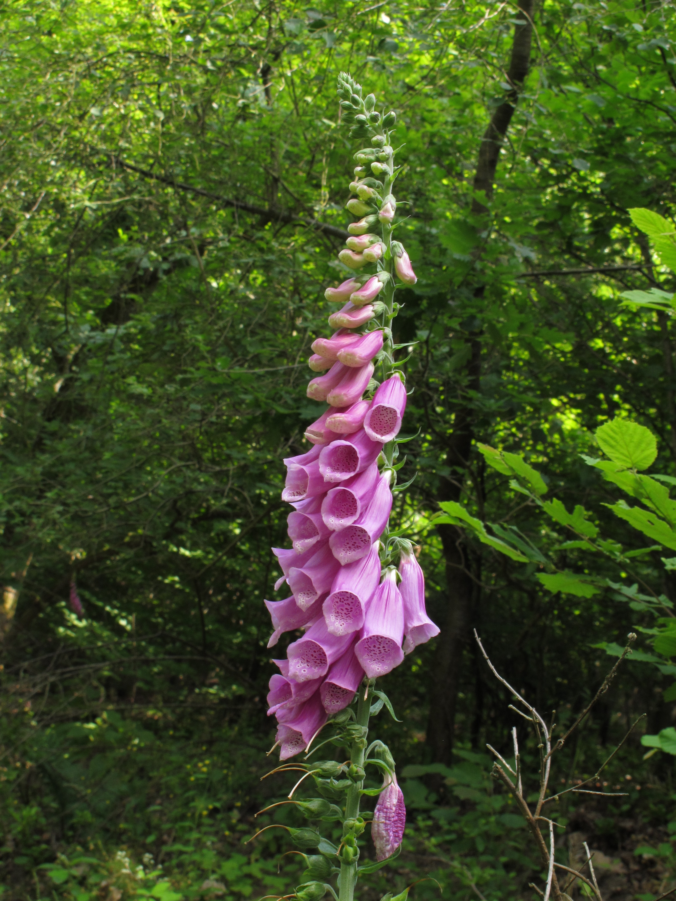

# 毛地黄 | Foxglove | *Digitalis purpurea*

*Purple foxglove flowers showing characteristic tubular bell-shaped blooms*

| 属性 | 内容 |
|------|------|
| 中文名 | 毛地黄 |
| 英文名 | Foxglove |
| 学名 | *Digitalis purpurea* |
| 分类 | 不可食用 |
| 可食部位/毒部位 | 毒部位: leaves, flower, stem, root, seeds |
| 关键特征 |  |
| 种植难度 |  |

## 1. 形态与识别要点

毛地黄（Digitalis purpurea）为车前草科毛地黄属二年生或多年生草本植物，原产于欧洲西部和西南部。植株高度可达1.5-2米，第一年形成基生叶丛，第二年抽出高大花茎。叶片大型，椭圆状卵形至披针形，长10-35厘米，宽3-12厘米，边缘具细锯齿，叶面深绿色，背面灰白色，两面均被软毛，质地厚实柔软。基生叶具长柄，茎生叶互生，向上渐小且柄渐短。

*Complete foxglove plant showing rosette leaves and tall flower spike*

花序为顶生总状花序，长30-80厘米，密生20-80朵花。花大而显著，长4-5厘米，管状钟形，外面紫红色、粉色、白色或黄色，内面常有深色斑点和条纹，花冠5裂，下唇较大。雄蕊4枚，花药深紫色。花期6-8月。蒴果卵形，长1-1.3厘米，成熟时2瓣裂开，释放出众多细小种子。

*Close-up of foxglove flower interior showing spotted patterns*

根系为直根系，主根粗壮肉质，深入土壤，具有强大的储藏能力。全株被柔毛，具有特殊的苦味，轻微触碰不会有明显气味，但损伤后略有草腥味。

### 与相似种的区别

与白毛地黄（Digitalis lanata）区别：白毛地黄花序更密集，花朵更小，花冠外表面被白色绒毛，叶片较窄。与黄花毛地黄（Digitalis grandiflora）区别：黄花毛地黄花朵黄色，较小，植株矮小，叶片较小较窄。与大花毛地黄（Digitalis ambigua）区别：大花毛地黄花冠黄色带褐色网纹，植株更矮小。与毛蕊花（Verbascum）区别：毛蕊花花瓣5瓣辐射对称，毛地黄花朵管状不规则。需要特别注意的是，所有毛地黄属植物都含有剧毒的强心苷类化合物。

*White variety of foxglove showing color variation within the species*

## 2. 种植技巧

- **气候区域**: USDA zones 4-8, 耐寒性较强，适合北京以南大部分地区
- **光照需求**: 半阴，避免强烈阳光直射，林缘环境最佳
- **土壤要求**: 排水良好的酸性至中性土壤，富含腐殖质
- **pH值**: 5.5-7.0
- **浇水**: 保持土壤适度湿润，避免积水
- **施肥**: 
- **繁殖方式**: 种子播种, 春季3-4月播种, 秋季9-10月播种
- **病虫害防治**: 蚜虫, 红蜘蛛, 白粉病, 需注意通风
- **伴生建议**: 蕨类植物, 苔藓, 其他喜阴植物, 适合林缘花境

## 3. 常见品种

## 4. 化学成分与风味

## 5. 用法与搭配（仅可食用类）

### 保存方法

## 6. 毒理与禁忌

毛地黄全株含有剧毒的强心苷类化合物，主要包括洋地黄毒苷（digitoxin）、地高辛（digoxin）、洋地黄皂苷A（digitonin）等。这些化合物对心肌具有强烈的兴奋作用，能够增强心肌收缩力并减慢心率。强心苷的治疗剂量与中毒剂量之间的安全范围极其狭窄，即使是少量的误食也可能导致严重后果。儿童仅需食用2-3片叶子就可能致命，成人误食10-20克新鲜叶片也可能导致死亡。中毒症状包括恶心、呕吐、视觉异常（黄视症）、心律不齐、意识模糊等，严重时可导致心脏骤停死亡。

*Foxglove leaves - all parts of this plant contain deadly cardiac glycosides*

## 7. 参考资料

- [An Account of the Foxglove and some of its Medical Uses](https://archive.org/details/b21357805) — William Withering, 1785
- [Assessment report on Digitalis purpurea L., folium](https://www.ema.europa.eu/en/documents/herbal-report/final-assessment-report-digitalis-purpurea-l-folium_en.pdf) — European Medicines Agency, 2016
- [Poisonous Plants of North America](https://www.cabi.org/bookshop/book/9781780641447) — CABI Publishing, 2021
- [Major Herbs of Ayurveda](https://www.elsevier.com/books/major-herbs-of-ayurveda/williamson/978-0-443-07032-9) — Churchill Livingstone, 2002

---
*声明：本信息仅供参考，不替代专业医疗建议。*

## Local Image Gallery

*Downloaded high-resolution images for offline viewing:*

*Image 1: © Jörg Hempel (CC BY-SA 3.0 de)*

*Image 2: © Norbert Nagel (CC BY-SA 3.0)*

*Image 3: © Dominicus Johannes Bergsma (CC BY-SA 4.0)*

*Image 4: © Robert Flogaus-Faust (CC BY 4.0)*

*Image 5: © H. Zell (CC BY-SA 3.0)*
