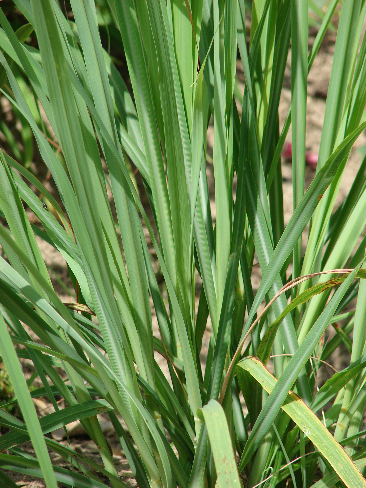
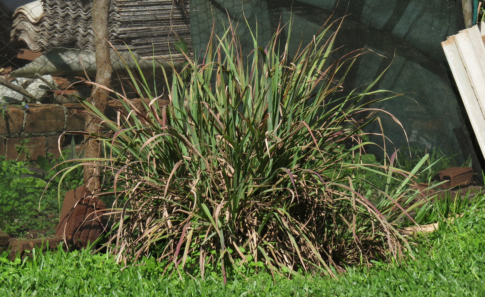

# 柠檬草/香茅 | Lemongrass | *Cymbopogon citratus*

*Lemongrass growing in clumps showing characteristic tall grass-like appearance*

| 属性 | 内容 |
|------|------|
| 中文名 | 柠檬草/香茅 |
| 英文名 | Lemongrass |
| 学名 | *Cymbopogon citratus* |
| 分类 | 可食用 |
| 可食部位/毒部位 | 可食部位: stem, leaves |
| 关键特征 | 多年生丛生草本；细长带状叶片；强烈柠檬香气；热带亚热带植物。 |
| 种植难度 | 中等（需温暖气候） |

## 1. 形态与识别要点

柠檬草（Cymbopogon citratus）为禾本科香茅属多年生丛生草本植物，原产热带亚洲。植株呈典型丛生状，可达1-2米高，基部形成密集的假鳞茎结构。叶片呈细长带状，长60-150厘米，宽0.5-2厘米，质地坚韧略粗糙，叶缘锋利需小心处理。叶片颜色从基部的浅黄绿到顶端的深绿色渐变，中脉明显，平行脉清晰可见。

最显著的识别特征是揉搓叶片或茎部时散发的强烈柠檬香气，这是由高含量的柠檬醛（citral）所致。基部的假鳞茎部分呈白色至淡黄色，质地较嫩且含有最高浓度的精油，是烹饪中最常用的部位。根系发达，为须根系，适应性强但不耐寒。

*Close-up of lemongrass stems showing the white tender base used in cooking*

花序为大型顶生圆锥花序，长20-50厘米，由多个总状花序组成，但在温带地区很少开花。小穗成对排列，含1-2朵小花，花期夏末至秋季。种子很少成熟，主要通过分株繁殖。植株在霜冻来临前会逐渐枯黄，在热带地区则可常年保持绿色。

### 与相似种的区别

与柠檬桉（Cymbopogon nardus）区分：柠檬桉叶片更宽，颜色偏蓝绿，香气带有桉树味而非纯柠檬香。与柠檬马鞭草（Aloysia citrodora）区分：马鞭草为木本灌木，叶片小且有锯齿，而柠檬草为草本，叶片大且光滑。与柠檬薄荷（Melissa officinalis）区分：薄荷叶片呈心形有锯齿，植株矮小，而柠檬草叶片细长无锯齿，植株高大。

## 2. 种植技巧

- **气候区域**: USDA 9-11
- **光照需求**: full sun to partial shade
- **土壤要求**: well-drained, fertile, sandy loam
- **pH值**: 6.0-7.5
- **浇水**: 喜湿润但排水良好的环境，生长期需充足水分但避免积水。干旱时增加浇水频率。
- **施肥**: 
- **繁殖方式**: division, stem cuttings
- **病虫害防治**: grasshoppers, aphids, rust disease, leaf blight
- **伴生建议**: tomato, basil, cilantro, peppers

## 3. 常见品种

柠檬草主要有两个商业品种：

**西印度柠檬草（Cymbopogon citratus）**：最常见的食用品种，假鳞茎部分较厚实，柠檬醛含量60-80%，香气浓郁纯正。叶片相对较宽，基部膨大明显，是东南亚料理的首选。耐湿性强，适合温室栽培。

**东印度柠檬草（Cymbopogon flexuosus）**：主要用于精油提取，植株更高大，叶片更细长。柠檬醛含量可达85%，但基部假鳞茎较细，食用价值相对较低。更适应较干燥的环境，精油产量高。

**柠檬桉草（Cymbopogon nardus 和 C. winterianus）**：主要用于提取柠檬桉醇，具有驱虫效果。香气偏桉树味，不适合食用但可用于制作天然驱蚊剂。

在选择栽培品种时，食用目的应选择西印度柠檬草，精油提取选择东印度品种，驱虫用途则选择柠檬桉草系列。

## 4. 化学成分与风味

柠檬草的化学成分主要集中在其挥发油中，含量约占鲜重的0.25-0.45%。主要活性成分为单萜类化合物：

**柠檬醛（Citral）**：由香叶醛（geranial）和橙花醛（neral）组成，是柠檬草精油的主要成分，占60-80%。柠檬醛具有强烈的柠檬香气，同时具有抗菌、抗炎和抗氧化特性。在传统医学中被认为有助消化、镇静和驱虫。

**月桂烯（Myrcene）**：占精油5-25%，提供草本和土质香调，具有肌肉松弛和镇静效果。

**柠檬烯（Limonene）**：增强柑橘清新感，具有抗癌潜力和情绪提升效果。

**香叶醇（Geraniol）**：带来花香调，具有抗菌和抗炎性质。

**柠檬醇（Citronellol）**：平衡香气层次，具有驱虫效果。

精油含量和组成受品种、生长环境、收获时期和提取方法影响。晨间收获的柠檬草精油含量最高，而基部假鳞茎的精油浓度最高。

## 5. 用法与搭配（仅可食用类）

柠檬草在东南亚料理中占据重要地位，其独特的柠檬香气为众多经典菜肴提供不可替代的风味基础。在泰式料理中，柠檬草是冬阴功汤（Tom Yum）的核心香料之一，与南姜、青柠叶形成经典的香气三角。制作时通常使用基部嫩白部分，拍松后加入汤中煮制，释放浓郁柠檬香气但不食用纤维部分。

在越南河粉（Pho）中，柠檬草与八角、桂皮等香料一同慢炖，为清澈的牛肉汤底增添清香层次。印尼仁当（Rendang）和马来咖喱中，柠檬草与椰浆和香料形成复合香气，平衡辛辣和甜腻。

*Vietnamese pho soup featuring lemongrass as a key aromatic ingredient*

**处理技巧**：使用前需去除外层老叶，保留内部嫩白至淡绿部分。可以拍松、切段或制成泥状，拍松释放香气但保持形状便于取出，制泥则完全融入菜肴。干燥的柠檬草叶可制茶，具有舒缓和助消化效果。

**搭配原理**：柠檬草的柠檬醛与椰浆的脂肪形成良好平衡，与辣椒的辣素产生协同增香效果，与鱼露的鲜味相互促进。在腌制海鲜时，柠檬草可有效去腥并增香。

### 保存方法

**鲜品保存**：整根柠檬草用湿纸巾包裹，置于冰箱冷藏室可保存2-3周。或将根部浸在少量水中如插花保养，覆盖塑料袋保湿，可延长保鲜期。

**冷冻保存**：去除外层老叶后切成5-8厘米段，平铺冷冻后装袋，可保存3-6个月。冷冻的柠檬草无需解冻可直接使用。

**制泥保存**：将嫩部分切碎与少量植物油打成泥状，分装在冰格中冷冻，使用时取一块即可，便于分量控制。

*Comparison of fresh lemongrass stalks and dried lemongrass for different culinary applications*

**干燥保存**：叶片洗净晾干后密封保存，避光阴凉处可保存1-2年，主要用于泡茶。干品香气虽有所减弱但仍具价值。

**精油保存**：自制或购买的柠檬草精油应存放在深色玻璃瓶中，避光低温保存，可保持香气2-3年。

注意新鲜柠檬草不宜常温长期保存，容易失水变硬且香气散失。

## 6. 毒理与禁忌

柠檬草在一般食用剂量下被认为是安全的，被美国FDA列为Generally Recognized as Safe（GRAS）食品添加剂。然而，需要注意以下几点：

**一般安全性**：柠檬草作为食品香料和茶饮原料使用历史悠久，未发现严重毒副作用。其主要成分柠檬醛在正常摄入量下对人体无害。

**过敏反应**：极少数人可能对柠檬草或其主要成分过敏，症状包括皮肤红疹、呼吸困难等。首次使用建议少量试用。

**精油使用注意**：高浓度柠檬草精油不应直接口服或大量摄入。外用时需适当稀释，避免皮肤刺激。

**特殊人群**：孕期和哺乳期妇女应适量食用，避免大量摄入精油制品。虽然传统上柠檬草被用作助产草药，但现代医学建议谨慎使用。

**药物相互作用**：柠檬草可能影响某些药物的代谢，特别是肝脏代谢的药物。正在服用药物的人群应咨询医生。

**传统医学应用**：在传统医学中，柠檬草被用于治疗消化不良、发热、关节疼痛等，但这些用途需要更多科学验证。现代研究显示其具有抗菌、抗炎和抗氧化特性，但治疗剂量使用需专业指导。

## 7. 参考资料

- [Plants of the World Online: Cymbopogon citratus](https://powo.science.kew.org/taxon/urn:lsid:ipni.org:names:405321-1) — Kew Gardens, 2024
- [USDA PLANTS Database: Cymbopogon citratus](https://plants.usda.gov/home/plantProfile?symbol=CYCI2) — USDA, 2023
- [Essential oil composition of Cymbopogon citratus](https://www.tandfonline.com/journals/tjeo20) — Journal of Essential Oil Research, 2022
- [Lemongrass: A review of its traditional uses, phytochemistry and pharmacology](https://www.sciencedirect.com/journal/journal-of-ethnopharmacology) — Journal of Ethnopharmacology, 2023
- [Chemical composition and antimicrobial activity of Cymbopogon citratus essential oil](https://www.sciencedirect.com/journal/food-chemistry) — Food Chemistry, 2023

---
*声明：本信息仅供参考，不替代专业医疗建议。*

## Local Image Gallery

*Downloaded high-resolution images for offline viewing:*

*Image 1: © Forest &amp; Kim Starr (CC BY 3.0)*

*Image 2: © Rafael Ghidini (CC BY-SA 4.0)*

*Image 3: © Obsidian Soul (CC0)*

*Image 4: © Nativeplants garden (CC BY-SA 4.0)*
