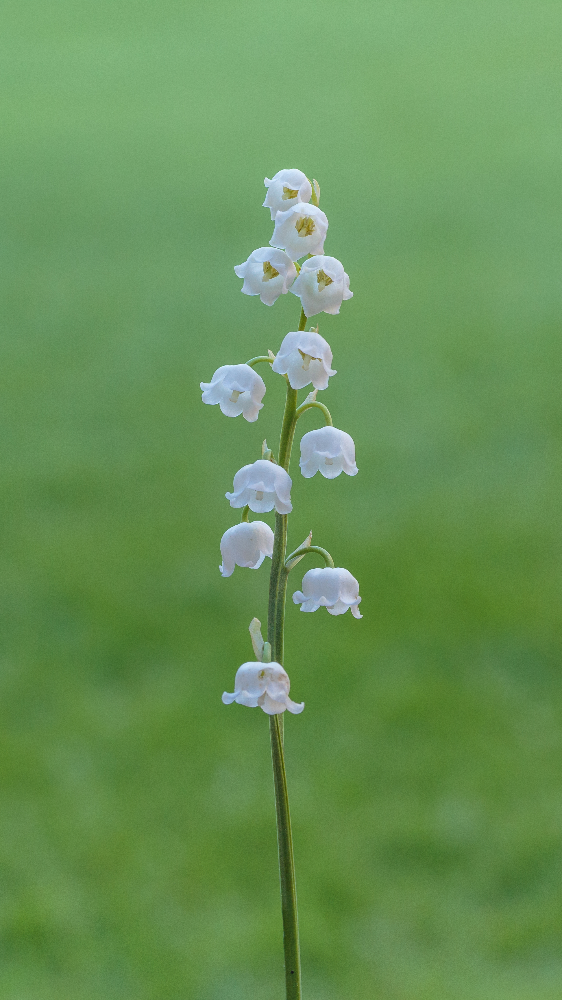
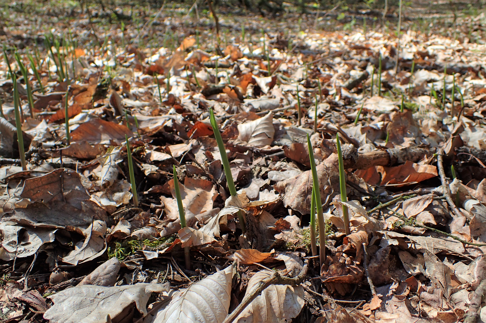

# 铃兰 | Lily of the Valley | *Convallaria majalis*

*Lily of the valley's characteristic bell-shaped white flowers hanging from arched stems*

| 属性 | 内容 |
|------|------|
| 中文名 | 铃兰 |
| 英文名 | Lily of the Valley |
| 学名 | *Convallaria majalis* |
| 分类 | 不可食用 |
| 可食部位/毒部位 | 可食部位: 未知 |
| 关键特征 |  |
| 种植难度 |  |

## 1. 形态与识别要点

铃兰（Convallaria majalis）为天门冬科铃兰属多年生草本植物，原产欧洲、亚洲和北美洲的温带和亚寒带地区。植株高度通常15-25厘米，具有地下匍匐根茎，在适宜环境下可形成大片群落。叶片通常2-3片，基生，椭圆形至宽披针形，长10-25厘米，宽3-8厘米，先端急尖，基部渐狭成鞘状柄。叶片深绿色，表面光滑有光泽，叶脉平行，质地较厚。

*Complete lily of the valley plant showing leaves and flower arrangement*

花茎从叶丛中抽出，高度15-20厘米，通常5-15朵花单侧下垂排列。花白色，钟形或壶形，长5-10毫米，花冠6裂，裂片向外卷曲，具浓郁甘美的香气。雄蕊6枚，花丝短，花药黄色。花期5-6月。果实为浆果，球形，直径5-7毫米，成熟时红色，内含1-3粒种子，果期8-9月。

*Red berries of lily of the valley in autumn - these are highly toxic*

根系为匍匐根茎，节间有不定芽，能够发育成新植株。整株植物在冬季地上部分枯萎，但地下根茎可安全过冬，春季重新萌发。

### 与相似种的区别

与蜘蛛抱蛋（Aspidistra elatior）区别：蜘蛛抱蛋叶片更大更宽，呈披针形，高可达60厘米，不开花或花极不显著；铃兰叶片较小，花显著且香气浓郁。与雪花莲（Galanthus）区别：雪花莲早春开放，花朵下垂但显著小于铃兰，花瓣有绿色斑点；铃兰春末夏初开放，花朵较大且纯白。与白三七（Trillium）区别：白三七叶片通常3片轮生，花单朵顶生；铃兰叶片基生，花多朵侧向下垂。需要特别注意的是，铃兰全株都含有剧毒的强心苷类化合物，绝不可以食用。

*Lily of the valley in its natural woodland habitat*

## 2. 种植技巧

- **气候区域**: USDA zones 2-7, 极其耐寒，适合中国大部分地区
- **光照需求**: 半阴至全阴，避免强烈直射阳光
- **土壤要求**: 湿润、排水良好的酸性至中性土壤，富含有机质
- **pH值**: 6.0-7.5
- **浇水**: 保持土壤湿润但不积水，夏季需要更多水分
- **施肥**: 
- **繁殖方式**: 分株繁殖, 根状茎分割, 春季或秋季进行
- **病虫害防治**: 蜗牛, 蛞蝓, 红蜘蛛, 需保持良好通风
- **伴生建议**: 蕨类植物, 玉簪, 落新妇, 适合林荫花境

## 3. 常见品种

## 4. 化学成分与风味

## 5. 用法与搭配（仅可食用类）

### 保存方法

## 6. 毒理与禁忌

铃兰的毒理学特征极其复杂且危险，是植物毒理学研究的重要对象。铃兰全株含有超过40种不同的强心苷类化合物，这是所有已知植物中强心苷种类最多的之一。主要毒性成分包括：1）铃兰毒苷（convallatoxin）：分子式C29H42O10，是毒性最强的成分，比洋地黄毒苷的毒性强约10倍；2）铃兰苦苷（convallamarin）：分子式C23H34O12，毒性略低于铃兰毒苷但仍然极其危险；3）铃兰苷（convallarin）：分子式C23H34O12，具有强烈的利尿作用，可导致严重脱水；4）其他次要强心苷：包括铃兰毒苷A、B、C等多种同系物。这些化合物的毒理机制主要通过抑制Na+/K+-ATP酶，导致细胞内Na+浓度升高，进而引起Ca2+内流增加，使心肌收缩异常增强。同时还能直接作用于心脏传导系统，引起严重的心律失常。铃兰强心苷的药代动力学特点是吸收快速、分布广泛、代谢缓慢。口服后15-30分钟即可被胃肠道吸收，1-2小时达到血药浓度峰值。这些化合物主要与心肌细胞膜上的Na+/K+-ATP酶结合，半衰期长达36-48小时，这解释了为什么铃兰中毒的症状持续时间长且难以治疗。致死机制主要是严重的心律失常导致心脏骤停，其次是呼吸中枢抑制导致呼吸衰竭。实验动物研究显示，铃兰毒苷的LD50（半数致死剂量）极低：小鼠静脉注射LD50为0.08mg/kg，口服LD50为0.3mg/kg。根据这些数据推算，成人的潜在致死剂量约为15-20颗成熟果实或30-40克新鲜叶片。

## 7. 参考资料

- [Poisonous Plants: A Handbook for Doctors, Pharmacists, Toxicologists, Biologists and Veterinarians](https://www.timberpress.com/book/9780881927511/poisonous-plants) — Timber Press, 2005
- [Compendium of botanicals reported to contain naturally occuring substances of possible concern for human health](https://efsa.onlinelibrary.wiley.com/doi/abs/10.2903/j.efsa.2012.2663) — European Food Safety Authority, 2012
- [Cardiac Glycosides in Convallaria majalis](https://pubs.acs.org/doi/abs/10.1021/np970444t) — Journal of Natural Products, 1998
- [Plant Poisoning Emergency Medicine](https://www.emed.theclinics.com/article/S0733-8627(11)00013-1/abstract) — Emergency Medicine Clinics of North America, 2011

---
*声明：本信息仅供参考，不替代专业医疗建议。*

## Local Image Gallery

*Downloaded high-resolution images for offline viewing:*

*Image 1: © Dominicus Johannes Bergsma (CC BY-SA 4.0)*

*Image 2: © Krzysztof Ziarnek, Kenraiz (CC BY-SA 4.0)*

*Image 3: © Agnes Monkelbaan (CC BY-SA 4.0)*

*Image 4: © Agnes Monkelbaan (CC BY-SA 4.0)*

*Image 5: © Ivar Leidus (CC BY-SA 4.0)*
