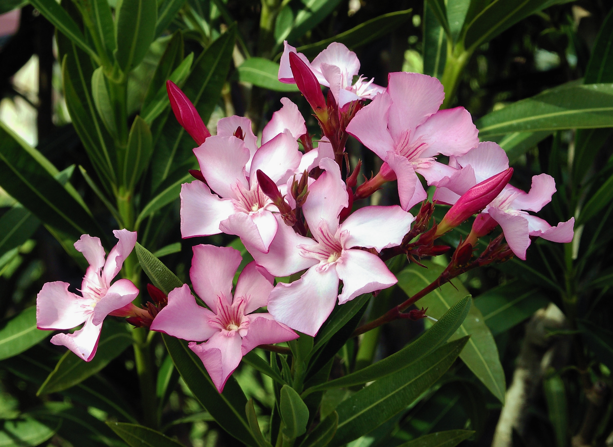

# 夹竹桃 | Oleander | *Nerium oleander*

*Pink oleander flowers - beautiful but deadly poisonous*

| 属性 | 内容 |
|------|------|
| 中文名 | 夹竹桃 |
| 英文名 | Oleander |
| 学名 | *Nerium oleander* |
| 分类 | 不可食用 |
| 可食部位/毒部位 | 毒部位: ALL PARTS - leaves, flowers, stems, bark, roots, sap |
| 关键特征 | 常绿灌木；革质全缘叶片、漏斗状5裂花冠；含剧毒强心苷，全株有毒乳汁，极度危险。 |
| 种植难度 | 容易（但强烈不推荐） |

## 1. 形态与识别要点

*Oleander shrub in full growth - beautiful but extremely poisonous landscaping plant*

夹竹桃（Nerium oleander）为夹竹桃科夹竹桃属常绿灌木，原产地中海地区，现世界各地广泛栽培作观赏植物。植株高度通常2-6米，在适宜条件下可达8米，呈直立灌丛状，分枝繁多，树形优美。茎干直立，表面光滑，幼枝绿色，老枝灰褐色，断面有白色乳汁渗出，此乳汁剧毒。

叶片对生或3-4片轮生，革质，长椭圆形至披针形，长5-21厘米，宽1-3.5厘米，全缘，叶面深绿色，光滑有光泽，叶背稍淡，主脉明显，侧脉平行。叶柄短，长约5毫米。

*Close-up of oleander leaves showing the characteristic leathery texture and prominent veins*

花朵极具观赏价值但剧毒：聚伞花序顶生，花朵漏斗状，直径4-5厘米，花冠5深裂，裂片呈螺旋状排列，常见粉红色、白色、红色或黄色，具淡香。花期长，从春末持续到秋季。雄蕊5枚，花药先端具毛状附属物。

### 与相似种的区别

*White variety of oleander - all colors and varieties are equally poisonous*

与桃花区分：桃花为蔷薇科，花朵5瓣分离，叶片有锯齿，果实为核果；夹竹桃花冠5裂连合，叶片全缘，果实为蓇葖果。与杜鹃区分：杜鹃花冠通常4-5裂但形态差异显著，叶片多为互生，植株形态完全不同。与茶花区分：茶花花朵更大，花瓣多层，叶片有锯齿；夹竹桃花朵相对较小，单层花冠，叶片全缘。

## 2. 种植技巧

⚠️ **重要警告：虽然夹竹桃观赏价值高，但因其剧毒特性，不建议在有儿童或宠物的环境中种植。**

- **气候区域**: USDA 8-11
- **光照需求**: full sun to partial shade
- **土壤要求**: well-drained, tolerates poor soils
- **pH值**: 6.0-8.5
- **浇水**: 中等需水，建立后耐旱性强；避免积水
- **施肥**: 春季施用缓释肥，不需频繁施肥
- **繁殖方式**: stem cuttings, layering, seed
- **病虫害防治**: scale insects, aphids, oleander caterpillars
- **伴生建议**: 避免与食用植物伴生

## 3. 常见品种

⚠️ **所有夹竹桃品种均剧毒，严禁食用或药用！**

**Pink Oleander（粉红夹竹桃）**：最常见品种，花朵粉红色，香气淡雅，观赏价值高但毒性极强。

**White Oleander（白花夹竹桃）**：花朵纯白色，清雅素净，常用于正式庭园景观，毒性与粉红品种相同。

**Red Oleander（红花夹竹桃）**：花朵深红色，色彩鲜艳，观赏价值很高，但毒性不减。

**Double-flowered varieties（重瓣品种）**：花朵重瓣，花型饱满，包括重瓣粉、重瓣白等，毒性同样极强。

**Dwarf varieties（矮生品种）**：植株较矮小，适合盆栽和小空间种植，但毒性并未因此降低。

## 4. 化学成分与风味

⚠️ **剧毒成分警告：夹竹桃含多种强心苷类毒素，极微量即可致死！**

夹竹桃含有多种剧毒的强心苷类化合物，主要包括夹竹桃苷、洋地黄毒苷等，这些化合物对心脏和神经系统具有极强毒性。

## 5. 用法与搭配（仅可食用类）

⚠️ **绝对禁止**：夹竹桃全株剧毒，严禁任何形式的食用、药用或接触。即使少量接触也可能导致严重中毒。

### 保存方法

**严禁保存**：夹竹桃不应用于任何食品或药用目的，修剪产生的枝叶应安全处置，避免接触。

*Warning sign often placed near oleander plantings due to extreme toxicity*

## 6. 毒理与禁忌

**⚠️ 极度危险：夹竹桃全株剧毒，接触、食用均可致死！⚠️**

## 7. 参考资料

---
*声明：本信息仅供参考，不替代专业医疗建议。*

## Local Image Gallery

*Downloaded high-resolution images for offline viewing:*

