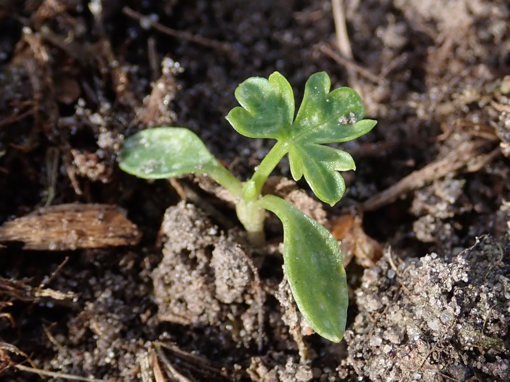

# 欧芹 | Parsley | *Petroselinum crispum*

*Flat-leaf parsley (left) and curly-leaf parsley (right) showing the main varieties*

| 属性 | 内容 |
|------|------|
| 中文名 | 欧芹 |
| 英文名 | Parsley |
| 学名 | *Petroselinum crispum* |
| 分类 | 可食用 |
| 可食部位/毒部位 | 可食部位: leaves, stem |
| 关键特征 | 两年生伞形科草本，第一年营养生长、形成浓密叶丛；第二年抽薹开伞形复伞花序。叶形因品种而异：平叶欧芹叶片扁平、裂片清晰，风味更浓；卷叶欧芹叶缘卷曲、观赏性强。 |
| 种植难度 | 容易至中等（耐凉爽、幼苗期生长缓慢） |

## 1. 形态与识别要点

欧芹（Petroselinum crispum）为伞形科两年生草本，第一年以叶丛形态为主，第二年春夏抽薹开花。叶片互生但在基部呈莲座状簇生，叶柄较长，叶片为二至三回羽状分裂。平叶欧芹（Italian flat-leaf）叶片扁平，裂片更宽，表面较为平整，揉搓后草本清香更为直接且带轻微辛感，因此在专业厨房中更常用于烹饪本体而不仅是装饰。卷叶欧芹（Curly）叶缘明显卷曲、质地饱满且立体感强，装盘观感佳，风味则相对温和。欧芹根系为主根较小的纤维状根系，而在根欧芹品类（Hamburg root parsley）中，主根明显膨大可食，与胡萝卜、欧洲萝卜类似的烹饪方式。花序为典型伞形科复伞花序，小花白色至淡黄，结果为双悬果。形态识别上，可通过叶形与卷曲度、香气与触感快速区分平叶与卷叶。幼苗期种皮含挥发油导致发芽缓慢而不整齐，温凉环境下保持稳定湿度可改善出苗与早期长势。

### 与相似种的区别

与香菜（Coriandrum sativum）之区别：外观上香菜叶裂更深、叶薄且柔软，抽薹后花序更为疏散；气味上，香菜揉叶表现出明显的醛类青香与部分人群感知的“肥皂味”，而欧芹以清新草香、微辛与轻苦为主，缺乏醛类皂感。烹饪上，欧芹更适合作为“基础香草”融入底味与收尾提鲜，香菜则在冷菜与短时加热的明亮提香中占优势。

## 2. 种植技巧

- **气候区域**: USDA 2-11
- **光照需求**: full sun to partial shade
- **土壤要求**: fertile, well-drained loam with organic matter
- **pH值**: 6.0-7.5
- **浇水**: 保持均匀湿润，忌积水；幼苗期水分稳定有助于齐苗与缓慢生长阶段稳定输出。
- **施肥**: 
- **繁殖方式**: seed
- **病虫害防治**: aphids, leafminers, slugs, snails
- **伴生建议**: tomato, asparagus, rose

## 3. 常见品种

- Italian flat-leaf（平叶欧芹）：风味浓郁、纤维相对少，适合切碎后直接入菜、制酱（如salsa verde、chimichurri）或热菜收尾。
- Curly leaf（卷叶欧芹）：质地紧致、观赏性强，适合作为装饰或需要体积感的冷盘；风味相对温和。
- Hamburg root parsley（根欧芹）：以根供食，口感类似胡萝卜与欧洲萝卜之间，适合烤、炖或做汤底，叶片亦可少量作香草使用。

*Parsley flowers in second year - typical umbel formation of apiaceae family*

*Hamburg parsley showing the edible thick white root used as a vegetable*

## 4. 化学成分与风味

欧芹叶片富含类黄酮（如 apigenin 及其苷），贡献抗氧化能力与轻微苦味基调；精油中含 myristicin、apiol 等苯丙烯类与萜类，带来温暖辛香的底色。值得注意的是，这些成分在品种、栽培环境与收获阶段显著波动。营养角度，欧芹以维生素K、维生素C与维生素A（以β-胡萝卜素/叶黄素等类胡萝卜素形式）含量突出：
- 维生素K：参与凝血与骨代谢，欧芹含量极高，凝血药物（华法林）使用者需注意日常摄入稳定性。
- 维生素C：抗氧化与胶原合成，生食保留更佳。
- 维生素A前体：有助视觉与免疫；与油脂同食利于吸收。
微量矿物质如铁、钾、镁亦具代表性。综合而言，欧芹在“营养密度/风味密度”双高的香草中名列前茅。

## 5. 用法与搭配（仅可食用类）

欧芹是地中海料理的“基础香草”之一，既能进入“基础香底”（如意大利式 sofrito、西式 mirepoix 的变体）提供清新绿色层次，也能在收尾撒入以提亮整体。经典菜例包括：
- Tabbouleh（塔布勒）：以大量切碎欧芹与薄荷、粗麦仁（bulgur）、番茄与柠檬汁调和，体现其“主体香草”而非点缀的角色。
- Gremolata：欧芹+蒜+柠檬皮屑，常用于炖小牛腱（Osso Buco）的收尾，去腻并提香。
- Salsa verde/Chimichurri：与酸味、蒜、橄榄油的组合，适合烤肉与烤蔬菜。
- Pesto 变体：以欧芹替代或部分替代罗勒，风味更清洁且耐热。
使用要点：细切避免反复碾压以减少渗水与发黑；热菜中应于出锅前撒入以保留清新香气。与柠檬、酸豆、凤尾鱼、蒜、辣椒碎的组合适配性极高。

### 保存方法

短存：湿纸巾包裹后入透气袋冷藏，或插水杯并松覆塑料袋保持湿度。长期：细切与橄榄油混合后装入冰格冷冻；亦可调制欧芹青酱分装冷冻。避免长时间高温干燥以免香气锐减。

*Dried parsley flakes - less flavorful than fresh but convenient for long storage*

## 6. 毒理与禁忌

一般食用安全；对维生素K摄入需控制的人群应评估食用量。高剂量精油并不用于普通膳食，孕期、肾病患者与抗凝人群应避免摄入精油级制品。总体而言，作为食材的叶与茎在常规摄入水平下是安全的。

## 7. 参考资料

- [Plants of the World Online: Petroselinum crispum](https://powo.science.kew.org/taxon/urn:lsid:ipni.org:names:847017-1) — Kew Gardens, 2024
- [USDA PLANTS Database: Petroselinum crispum](https://plants.usda.gov/home/plantProfile?symbol=PECR) — USDA, 2020
- [USDA FoodData Central: Parsley, raw](https://fdc.nal.usda.gov/) — USDA, 2019
- [PubChem Compound Summary: Apiol](https://pubchem.ncbi.nlm.nih.gov/compound/31236) — PubChem, 2024

---
*声明：本信息仅供参考，不替代专业医疗建议。*

## Local Image Gallery

*Downloaded high-resolution images for offline viewing:*

*Image 1: © H. Zell (CC BY-SA 3.0)*

*Image 2: © Maurocatanese86 (CC BY-SA 4.0)*

*Image 3: © Salicyna (CC BY-SA 4.0)*

*Image 4: © Schlaghecken Josef (CC BY-SA 4.0)*
