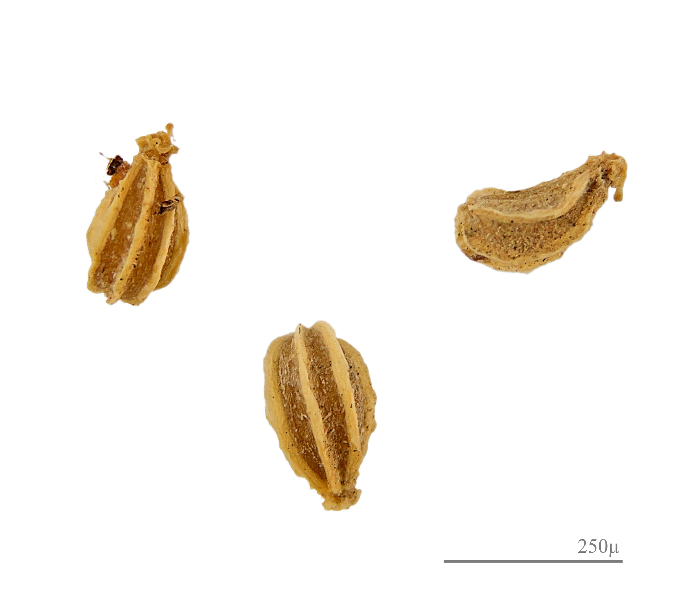
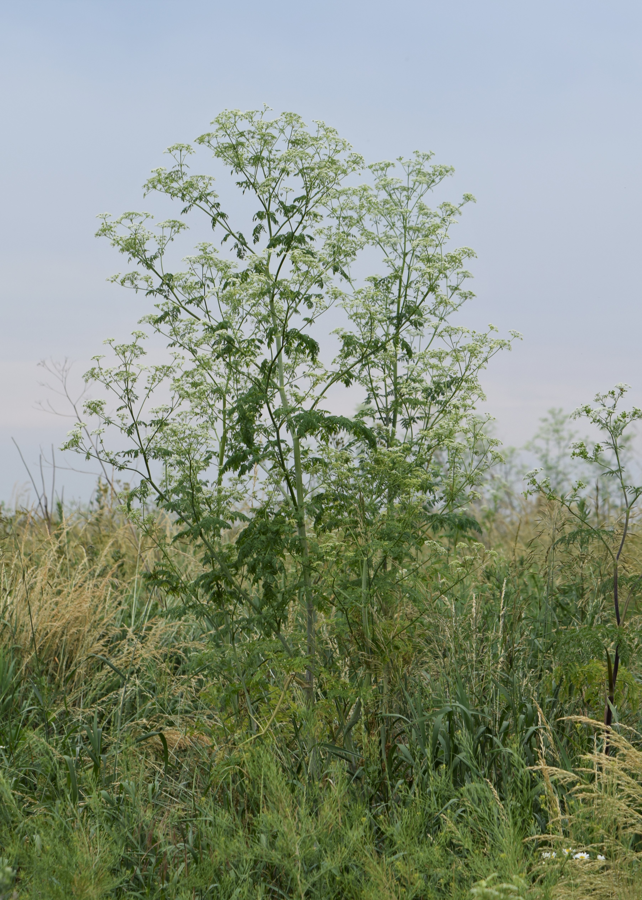
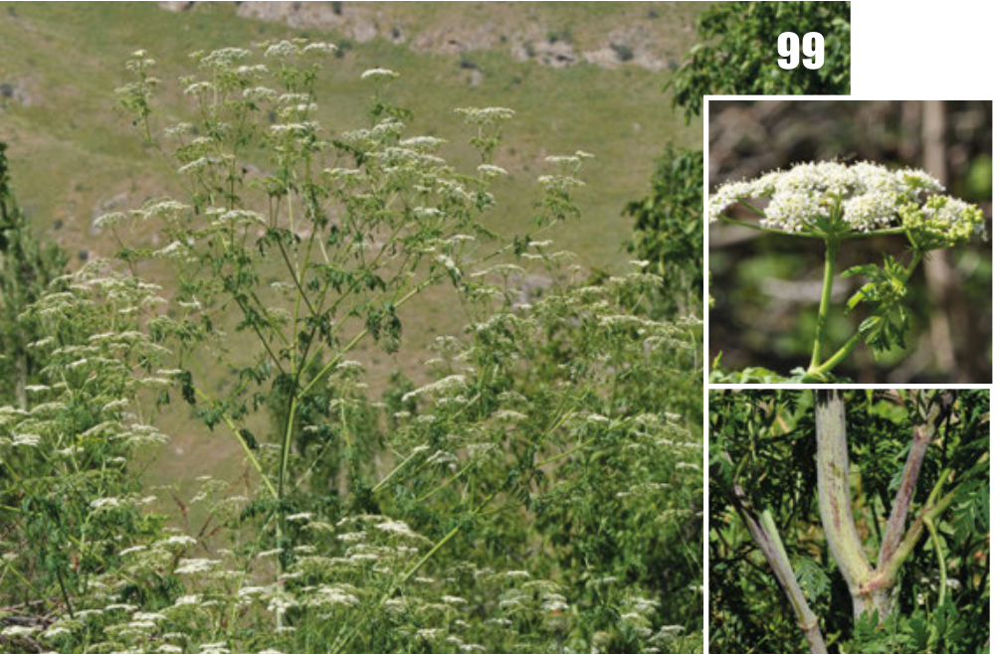

# 毒芹 | Poison Hemlock | *Conium maculatum*

| 属性 | 内容 |
|------|------|
| 中文名 | 毒芹 |
| 英文名 | Poison Hemlock |
| 学名 | *Conium maculatum* |
| 分类 | 不可食用 |
| 可食部位/毒部位 | 可食部位: 未知 |
| 关键特征 |  |
| 种植难度 |  |

## 1. 形态与识别要点

*毒芹整株植物，可见其高大的伞形花序和分枝茎杆*

毒芹是伞形科植物中的危险种类，可长至1.5-3米高。茎杆空心且光滑，具有特征性的紫红色斑点，这是重要的识别特征。叶片为二到三回羽状复叶，小叶深裂，整体轮廓呈三角形，叶片压碎后有刺鼻的鼠尿味。

*毒芹叶片特写，显示其精细分裂的羽状复叶*

花序为复伞形花序，直径5-10厘米，由多个小伞形花序组成，每个小伞形花序有15-25朵白色小花。花期通常在夏季，果实为双悬果，椭圆形，表面有明显的肋纹。

*毒芹白色伞形花序*

*毒芹茎部特写，可见特征性的紫红色斑点*

### 与相似种的区别

毒芹最容易与其他伞形科植物混淆，特别是水芹菜、胡萝卜叶和欧芹。关键识别要点：
1. **茎杆斑点**：毒芹茎部有紫红色斑点，其他安全的伞形科植物通常没有
2. **气味**：毒芹叶片压碎后有刺鼻鼠尿味，而水芹等有清香味
3. **生长高度**：毒芹可长到2-3米，远高于多数食用伞形科植物
4. **叶片质地**：毒芹叶片较薄且光滑，食用类通常更厚实

*毒芹种子，呈椭圆形带有明显的肋纹*

## 2. 种植技巧

- **气候区域**: USDA zones 6-10, 适应性强，几乎在所有温带地区都能生长
- **光照需求**: 全日照至半阴，适应性强
- **土壤要求**: 湿润的壤土，特别喜欢肥沃的土壤
- **pH值**: 6.0-8.0，对土壤酸碱度适应性强
- **浇水**: 喜湿润环境，常见于水边、沟渠旁
- **施肥**: 
- **繁殖方式**: 种子繁殖, 春季播种, 自播能力强
- **病虫害防治**: 很少受到病虫害侵扰, 因含有毒素天然抗虫
- **伴生建议**: 作为杂草出现, 常与其他伞形科植物混生

## 3. 常见品种

## 4. 化学成分与风味

## 5. 用法与搭配（仅可食用类）

### 保存方法

## 6. 毒理与禁忌

*历史植物图谱中的毒芹，显示其各部分形态特征*

毒芹的毒理学研究历史悠久且内容丰富，是植物毒理学的经典研究对象。毒芹含有的哌啶类生物碱是其主要毒性成分，这类化合物的生物合成途径起始于赖氨酸的脱羧作用。主要生物碱包括：1）毒芹碱（coniine）：分子式C8H17N，是最主要的毒性成分，含量占总生物碱的85-95%。其化学结构与烟碱相似，但缺少吡啶环的双键，这使其毒性更强且更稳定。毒芹碱是烟碱型乙酰胆碱受体的竞争性拮抗剂，首先激活受体产生兴奋作用，随后产生持续性阻断，导致神经肌肉传导功能丧失。2）γ-毒芹碱（γ-coniceine）：分子式C8H15N，是毒芹碱的生物合成前体，毒性比毒芹碱强2-3倍。它主要存在于幼嫩植株中，随着植物成熟逐渐被氧化为毒芹碱。3）N-甲基毒芹碱（N-methylconiine）：毒性略低于毒芹碱，但同样危险。4）伪毒芹碱（pseudoconiine）：含量较少，毒性相对较低。这些生物碱在植物体内的分布不均匀：种子中浓度最高（0.5-2.0%干重），根部次之（0.05-0.2%），叶片中含量相对较低但仍然危险（0.03-0.1%）。毒芹碱的毒理机制复杂：它能穿过血脑屏障，对中枢神经系统和周围神经系统都有影响；在低浓度时激活烟碱型受体，引起肌肉颤动；在高浓度时阻断这些受体，导致肌肉麻痹；还能影响自主神经系统，引起心律不齐和血压变化。毒代动力学特点：口服后迅速被胃肠道吸收，30-60分钟达到血药浓度峰值；主要在肝脏代谢，产生无毒的代谢产物；半衰期1-3小时，但毒性作用可持续6-12小时。人类中毒剂量：最小中毒剂量约100mg毒芹碱，致死剂量150-300mg，相当于6-10g新鲜叶片或2-3g种子。

## 7. 参考资料

- [Hemlock alkaloids from Socrates to poison aloes](https://www.sciencedirect.com/science/article/pii/S0031942205001846) — Phytochemistry, 2005
- [Nicotinic plant poisoning](https://www.tandfonline.com/doi/abs/10.1080/15563650903252186) — Clinical Toxicology, 2009
- Poison Hemlock (Conium maculatum L.) - A Review — Veterinary and Human Toxicology, 1988
- The Death of Socrates: A Historical and Scientific Investigation — Journal of the History of Medicine and Allied Sciences, 2001

---
*声明：本信息仅供参考，不替代专业医疗建议。*

## Local Image Gallery

*Downloaded high-resolution images for offline viewing:*

*Image 1: © MPF (CC BY-SA 3.0)*

*Image 2: © Didier Descouens (CC BY-SA 4.0)*

*Image 3: © Krzysztof Ziarnek, Kenraiz (CC BY-SA 4.0)*

*Image 4: © Arkadiusz Nowak, Marcin Nobis, Sylwia Nowak, Agnieszka Nobis, Anna Wróbel, Sebastian Świerszcz, Ewelina Klichowska, Iwona Dembicz &amp; Grzegorz Kusza (CC BY 4.0)*

