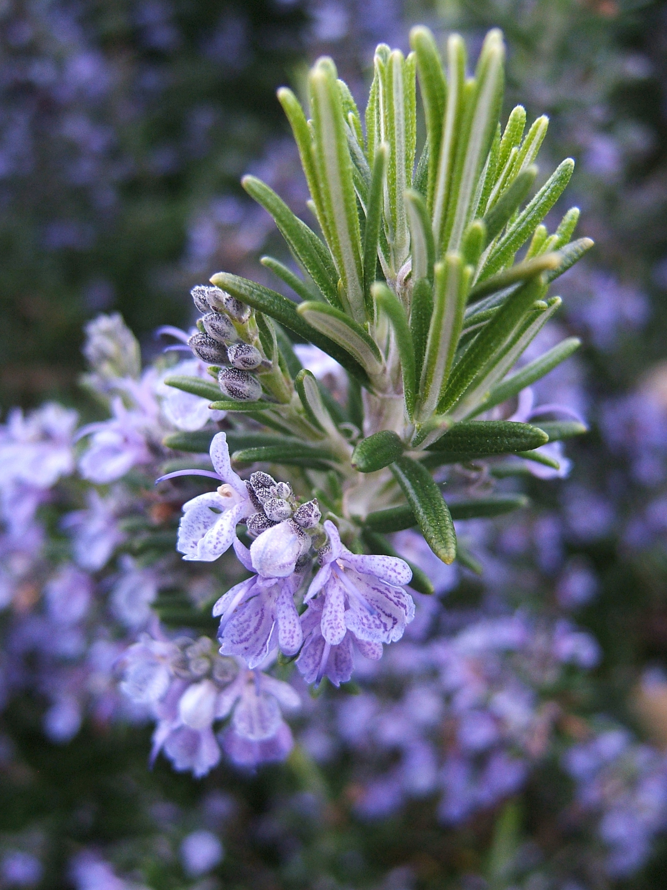
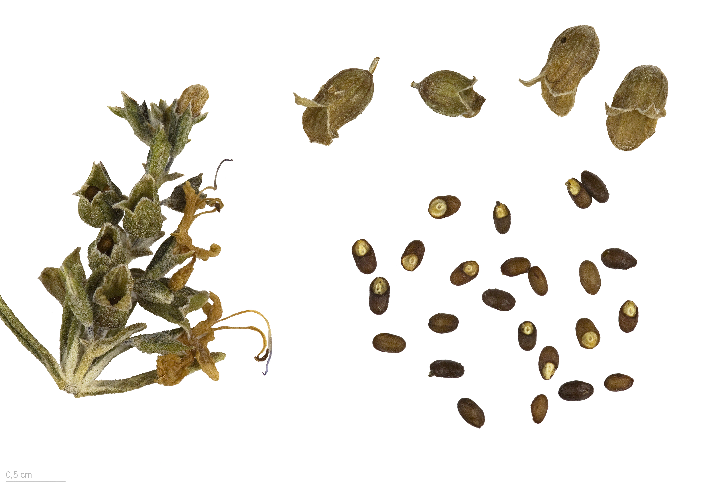

# 迷迭香 | Rosemary | *Rosmarinus officinalis*

| 属性 | 内容 |
|------|------|
| 中文名 | 迷迭香 |
| 英文名 | Rosemary |
| 学名 | *Rosmarinus officinalis* |
| 分类 | 可食用 |
| 可食部位/毒部位 | 可食部位: leaves, flower |
| 关键特征 | 常绿灌木；针状叶片革质深绿，下表面银白；花朵蓝紫色；强烈松香樟脑气味。 |
| 种植难度 | 容易（适应性强） |

## 1. 形态与识别要点

*地中海原生的迷迭香灌木，展示其典型的灌木形态*

迷迭香（Rosmarinus officinalis，现分类学上也称 Salvia rosmarinus）为唇形科鼠尾草属常绿小灌木，株高通常0.5-2米，在适宜环境可达3米。植株呈直立或半匍匐状，分枝繁茂。茎方形，幼时绿色柔软，老枝木质化呈褐色，表面粗糙有纵沟。叶片线形至线状披针形，长1-4厘米，宽1-4毫米，革质厚实，对生无柄；叶表深绿有光泽，叶背银白色具密集星状毛被；叶缘全缘且向下卷曲，质地坚韧；揉搓释放浓郁的松香与樟脑混合香气，穿透力强且持久。

*迷迭香叶片特写，可见针状叶片的深绿色表面和银白色背面*

花序为顶生或腋生的短穗状花序，花朵小而密集；花冠二唇形，长约1厘米，颜色多为蓝紫色，偶有白色或淡粉变种；雄蕊2枚突出花冠，花期主要在春末夏初，温暖地区可几乎全年开花。

*迷迭香蓝紫色花朵，展示典型的唇形科花冠形态*

果实为小坚果，褐色卵圆形。根系发达且深扎，主根可达1-2米，具强的耐旱和固土能力。
在形态识别方面，迷迭香的针状革质叶片和强烈的松香樟脑气味是最显著特征。与薰衣草相比，迷迭香叶片更狭窄且深绿，气味偏向松香而非花香；与其他唇形科香草相比，其叶背的银白色毛被和坚硬质地独具特色。

### 与相似种的区别

与薰衣草（Lavandula）区分：薰衣草叶片较宽且整体银灰色调明显，花穗长而密集呈紫色；迷迭香叶片狭窄深绿，花朵较分散。与其他鼠尾草属植物区分：多数鼠尾草叶片较宽大柔软，而迷迭香叶片坚硬针状。气味上，迷迭香独特的松香樟脑调是关键识别点。

## 2. 种植技巧

- **气候区域**: USDA 7-10
- **光照需求**: full sun
- **土壤要求**: well-drained, sandy or rocky soil
- **pH值**: 6.0-7.5
- **浇水**: 耐旱植物，需排水良好的土壤；成株后可承受短期干旱，但幼苗需适度浇水；避免根部积水。
- **施肥**: 
- **繁殖方式**: softwood cuttings, semi-hardwood cuttings, seed
- **病虫害防治**: spider mites, aphids, whiteflies, powdery mildew
- **伴生建议**: cabbage, beans, carrots, sage

## 3. 常见品种

- Tuscan Blue：经典直立型品种，叶片深绿，花朵深蓝紫色，香气浓郁，适合烹饪使用。
- Arp：抗寒性强的品种，可耐受USDA 6区低温，株型紧凑，适合北方地区种植。
- Hill Hardy：另一抗寒品种，叶片略宽，香气温和，适合园林绿化和药用。
- Prostrate（匍匐迷迭香）：低矮匍匐生长，高度仅20-50厘米，适合地被覆盖和悬挂种植，观赏性强。
- Miss Jessopp's Upright：直立性极强的高大品种，可达2米，叶片细长，是制作香草篱笆的理想选择。

## 4. 化学成分与风味

迷迭香的化学成分极其复杂丰富，主要包括酚酸类、单萜类和倍半萜类化合物：
- 迷迭香酸（Rosmarinic acid）：含量可达干重的3-4%，是强效的天然抗氧化剂，抗氧化能力超过维生素E，同时具有抗炎、抗菌、抗病毒活性，是迷迭香药用价值的核心成分。
- 樟脑（Camphor）：赋予迷迭香穿透性的清凉香气，具有提神醒脑的作用，在芳香疗法中广泛使用。
- 1,8-桉叶素：带来清新的松针样香气，具有祛痰和抗菌功效，是迷迭香精油的重要成分。
- α-蒎烯：贡献树脂般的松香气味，具有抗炎和支气管扩张作用。
化学成分的含量受品种、生长环境、收获时间影响显著，地中海原产地的野生迷迭香通常具有更高的活性成分含量。

## 5. 用法与搭配（仅可食用类）

*干燥的迷迭香，是厨房中常用的调味香料*

迷迭香在地中海料理中地位崇高，被誉为「海之露珠」。其强烈的松香樟脑调特别适合与肉类搭配，能有效去腥增香并具有天然防腐作用。在烤羊肉中，新鲜迷迭香枝条可直接作为串烤签使用，使香味充分渗透；与蒜泥、橄榄油调制的迷迭香酱是地中海烤鸡的经典搭配。面包烘焙中，迷迭香与海盐的组合（如佛卡恰面包）能带来层次丰富的咸香味觉体验。在制作香草油时，低温浸泡的迷迭香橄榄油可保持数月而不变质，是优质的调料基础。

*迷迭香烤土豆，展示其在烹饪中的经典应用*

值得注意的是，迷迭香香味浓烈，使用时应适量，过量会产生苦味。干燥迷迭香比新鲜品香味更集中，用量应相应减少。在炖煮类菜肴中，建议使用整枝新鲜迷迭香，便于最后取出，避免针状叶片混入菜品影响口感。

### 保存方法

新鲜迷迭香：剪取健康枝条，去除下部叶片，插入清水中如鲜花般保存，可维持1-2周新鲜；冷藏时用湿纸巾轻包后放入保鲜袋。干燥保存：选择晴天清晨露水散后采收，悬挂在通风阴凉处自然晾干，或使用食物脱水机低温干燥；完全干燥后搓下叶片，存于密封玻璃瓶中可保存1年以上。制作迷迭香盐：新鲜叶片与粗海盐按1:3比例混合，密封腌制1月后使用。冷冻保存：洗净沥干后整枝冷冻，使用时无需解冻直接烹饪。

## 6. 毒理与禁忌

迷迭香作为传统烹饪香料一般安全，但需注意适量原则。过量摄入迷迭香或其精油可能导致胃肠不适、恶心呕吐等症状。孕妇特别是怀孕早期应避免大量摄入，因其可能具有子宫刺激作用。哺乳期妇女、癫痫患者、高血压患者使用前应咨询医师。迷迭香精油浓度极高，不可直接口服，皮肤使用需稀释。对唇形科植物过敏者应谨慎使用。正常烹饪用量（每餐1-2茶匙干品或等量鲜品）被认为是安全的。

## 7. 参考资料

- [Plants of the World Online: Rosmarinus officinalis](https://powo.science.kew.org/taxon/urn:lsid:ipni.org:names:447986-1) — Kew Gardens, 2024
- [USDA PLANTS Database: Rosmarinus officinalis](https://plants.usda.gov/home/plantProfile?symbol=ROOF) — USDA, 2020
- [PubChem Compound Summary: Rosmarinic acid](https://pubchem.ncbi.nlm.nih.gov/compound/Rosmarinic-acid) — PubChem, 2024
- [European Medicines Agency: Rosmarinus officinalis](https://www.ema.europa.eu/en/medicines/herbal/rosmarini-folium) — EMA, 2022

---
*声明：本信息仅供参考，不替代专业医疗建议。*

## Local Image Gallery

*Downloaded high-resolution images for offline viewing:*

*Image 1: © THOR (CC BY 2.0)*

*Image 2: © T137 (CC BY-SA 3.0)*

*Image 3: © Roger Culos (CC BY-SA 3.0)*

*Image 4: © Basotxerri (CC BY-SA 4.0)*

*Image 5: © Christian Ferrer (CC BY 4.0)*
