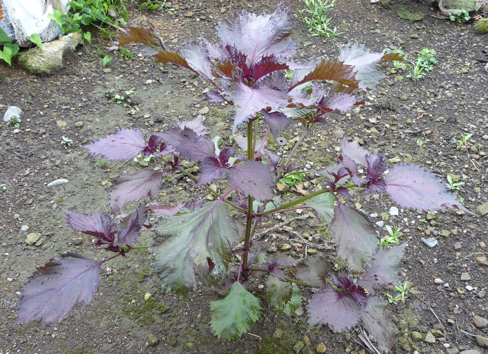

# 紫苏 | Shiso/Perilla | *Perilla frutescens*

| 属性 | 内容 |
|------|------|
| 中文名 | 紫苏 |
| 英文名 | Shiso/Perilla |
| 学名 | *Perilla frutescens* |
| 分类 | 可食用 |
| 可食部位/毒部位 | 可食部位: leaves, seeds, flower |
| 关键特征 | 一年生草本；方茎、对生齿缘叶、紫红或绿色；揉叶具独特清香薄荷样香气。 |
| 种植难度 | 容易 |

## 1. 形态与识别要点

*紫苏植株，可见其典型的方茎和对生锯齿叶片*

紫苏（Perilla frutescens）为唇形科紫苏属一年生直立草本，株高通常30-100厘米，茎呈方形，多分枝，幼时被细柔毛。叶片对生，卵形至宽卵形，长4-13厘米，宽2.5-10厘米，先端急尖或渐尖，基部圆形或宽楔形，边缘具粗锯齿。叶面依品种不同呈现绿色、紫红色或绿紫相间，质地柔软，两面均被短柔毛，主脉明显。轻揉叶片即散发独特的清香，带有薄荷样清凉感与轻微辛香。

*青紫苏（绿色品种）叶片特写*

花序为顶生或腋生的总状花序，花小而密集，花冠唇形，白色至淡紫色，花期7-9月。

*紫苏的唇形小花*

果实为小坚果，卵球形，表面网纹状，成熟时褐色。紫苏的根系为须根系，主根不发达，侧根较多，适应性强。

在形态识别上，紫苏可通过其特有的香气、方茎、对生锯齿叶片和唇形花序等特征与其他植物区别。与彩叶草相比，紫苏叶片锯齿较浅，香气独特；与韩国薄荷相比，紫苏香气更复杂，不仅有薄荷感还带有特殊的芳香调。

### 与相似种的区别

与彩叶草（Coleus）区分：彩叶草叶缘锯齿更深更密，叶面颜色斑驳多变，揉叶后无明显香气或仅有轻微青草味；紫苏叶面颜色较均一，香气清香独特。与韩国薄荷区分：韩国薄荷香气主要为薄荷醇的清凉感，较为单一；紫苏香气层次丰富，除薄荷感外还有复杂的芳香调。与普通薄荷区分：普通薄荷叶片更窄长，香气纯粹清凉；紫苏叶片更宽，香气温和且带有独特的芳香层次。

## 2. 种植技巧

- **气候区域**: USDA 4-9
- **光照需求**: full sun to partial shade
- **土壤要求**: well-drained, moist, fertile loam
- **pH值**: 6.0-7.5
- **浇水**: 保持土壤湿润但避免积水，耐旱性中等；夏季高温期需增加浇水频率。
- **施肥**: 
- **繁殖方式**: seed, softwood cuttings
- **病虫害防治**: flea beetles, aphids, spider mites, bacterial leaf spot
- **伴生建议**: tomato, eggplant, beans, cucumber

## 3. 常见品种

- 赤紫苏（Red/Purple Shiso）：叶片呈深紫红色，富含花青素，香气浓郁；常用于制作梅干、染色和药用，观赏价值也很高。
- 青紫苏（Green Shiso）：叶片绿色，香气清雅，是日本料理中最常用的品种；适合生食、制作天妇罗和调味。
- 縮緬紫苏（Curly Shiso）：叶面皱缩呈波浪状，质地独特；多用于观赏和特殊料理装饰。
- 斑入紫苏（Bi-color Shiso）：叶片绿紫相间，具观赏价值；香气介于红绿紫苏之间，用途多样。

各品种在栽培要求上基本相同，但赤紫苏在日照充足时颜色更深，青紫苏在半阴环境下叶片更嫩绿。种子收获时，以青紫苏籽最为常用，可榨油或调味。

## 4. 化学成分与风味

紫苏的挥发油成分复杂，主要包括：
- Perillaldehyde（紫苏醛）：占挥发油的50-85%，是紫苏特有香气的主要来源，带来清新的薄荷样香气和轻微的辛辣感。这种化合物在其他植物中极为罕见，是识别紫苏的化学指纹。
- Limonene（柠檬烯）：提供柑橘样的清香，增强香气的明亮度和清新感，与perillaldehyde协同作用形成紫苏独特的香气谱。
- β-Caryophyllene（β-石竹烯）：贡献轻微的胡椒样辛香和木质调性，为香气增加深度和复杂度。
- Anthocyanins（花青素）：主要存在于赤紫苏中，不仅提供紫红色泽，还具有强抗氧化活性，是天然的食用色素。

紫苏籽富含α-亚麻酸（占脂肪酸的60%以上），是植物性Omega-3脂肪酸的优质来源。不同品种和生长条件下，化学成分含量会有显著差异，这也影响了其香气强度和食用品质。

## 5. 用法与搭配（仅可食用类）

*赤紫苏（紫红色品种），富含花青素*

紫苏在东亚料理中占据重要地位，其独特香气使其成为无可替代的调味植物。在日本料理中，青紫苏（大叶）是刺身的经典配菜，不仅增加清香还具有抗菌作用；制作天妇罗时，紫苏叶的香气在高温下会更加突出，与酥脆的面衣形成完美搭配。紫苏还是制作梅干（umeboshi）的必需品，赤紫苏为梅干提供了特有的红色和复杂香味。

*紫苏叶作为日式料理中生鱼片的经典配菜*

在韩国料理中，紫苏叶（깻잎/kkaennip）常用于包饭（ssam），其香气能很好地平衡烤肉的油腻感。紫苏叶腌制后的독특한 맛（独特味道）是韩式小菜的经典。中式烹饪中，紫苏常用于去腥调味，特别适合搭配河鲜和海鲜；紫苏炒田螺是江南地区的特色菜肴。

现代创新料理中，紫苏的应用越来越广泛：制作紫苏青酱（类似basil pesto）、紫苏鸡尾酒、紫苏冰淇淋等。

*紫苏籽，可用于榨油或调味*

其种子（紫苏子）可以榨油或直接调味，具有坚果香味。需要注意的是，紫苏叶不宜长时间高温烹煮，以免香气散失；最好在出锅前加入或生食使用。

### 保存方法

新鲜紫苏叶保存方法多样：短期保存可用湿纸巾轻包后装入保鲜袋冷藏，保鲜期3-5天；也可将茎部浸在清水中如插花般保存，并套塑料袋保湿。长期保存建议制成紫苏盐（叶片切碎混合海盐）或紫苏油（叶片与植物油按1:3比例浸泡）；急冻保存前可先汆烫30秒定色，然后沥干冷冻。干燥保存虽然方便，但香气损失较大，品质远不如冷冻保存。种子成熟后应及时收获并晾干保存，可榨油或来年播种。

## 6. 毒理与禁忌

紫苏一般安全可食，在亚洲地区有数千年的食用历史。但需注意紫苏籽油富含α-亚麻酸，大量摄入可能影响血液凝固功能，正在服用抗凝血药物者应咨询医师。孕期妇女虽可适量食用紫苏叶，但应避免大量摄入紫苏籽油。个别敏感体质者可能对紫苏过敏，出现皮疹或消化不适。传统中医认为紫苏性温，体质偏热者不宜大量长期食用。市售紫苏精油浓度极高，不建议直接口服，仅供外用或芳香疗法使用。

## 7. 参考资料

- [Plants of the World Online: Perilla frutescens](https://powo.science.kew.org/taxon/urn:lsid:ipni.org:names:453623-1) — Kew Gardens, 2024
- [Chemical composition and biological activities of Perilla frutescens](https://doi.org/10.1080/10412905.2020.1713393) — Journal of Essential Oil Research, 2020
- [Traditional uses and modern applications of Perilla](https://doi.org/10.1007/s11101-019-09599-5) — Phytochemistry Reviews, 2019

---
*声明：本信息仅供参考，不替代专业医疗建议。*

## Local Image Gallery

*Downloaded high-resolution images for offline viewing:*

*Image 1: © Namazu-tron (CC BY-SA 3.0)*

*Image 2: © Dalgial (CC BY-SA 3.0)*

*Image 3: © George E. Koronaios (CC BY-SA 2.0)*

