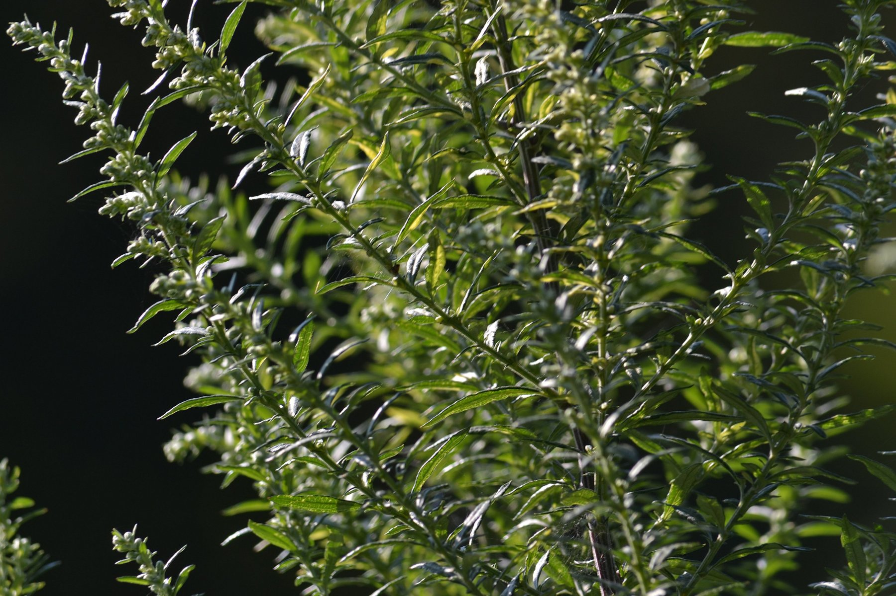
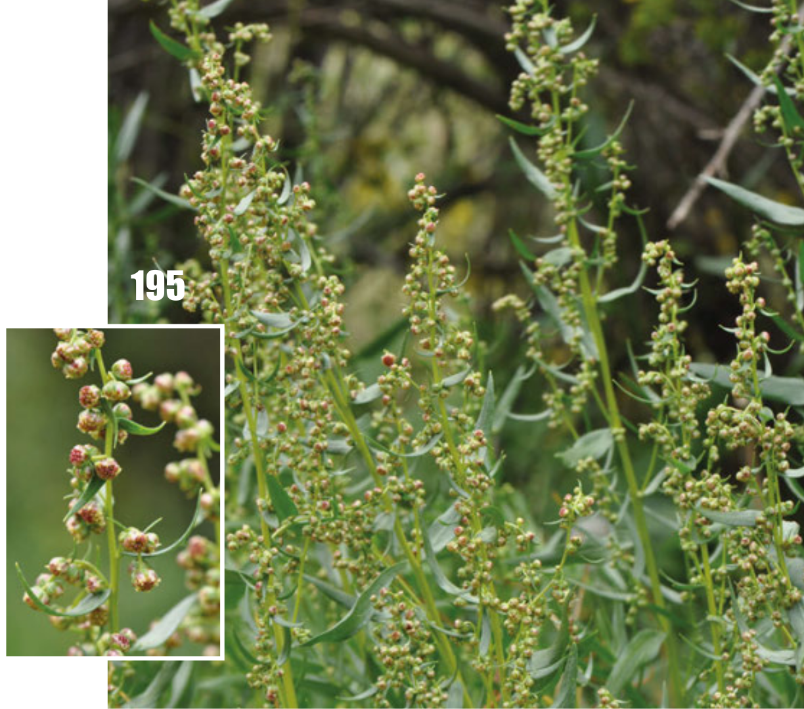

# 龙蒿 | Tarragon | *Artemisia dracunculus*

| 属性 | 内容 |
|------|------|
| 中文名 | 龙蒿 |
| 英文名 | Tarragon |
| 学名 | *Artemisia dracunculus* |
| 分类 | 可食用 |
| 可食部位/毒部位 | 可食部位: leaves |
| 关键特征 | 多年生草本；线形叶片、不分裂、互生；揉叶散发独特甘草与茴香样芳香。 |
| 种植难度 | 中等（需适当越冬保护） |

## 1. 形态与识别要点

*龙蒿整株植物，展示其直立丛生形态*

龙蒿（Artemisia dracunculus）为菊科蒿属多年生草本植物，株高通常60-120厘米，在理想条件下可达150厘米。植株具发达的地下根茎系统，能够通过根茎分蘖形成丛状生长。茎秆直立，光滑无毛，呈绿色至淡红褐色，节间明显，分枝性强，形成密集的灌丛状外观。

叶片为龙蒿最具识别性的特征：互生，线状披针形至线形，长2-8厘米，宽2-10毫米，全缘不分裂（这是与其他蒿属植物的重要区别），叶面光滑无毛，呈亮绿色至深绿色，叶脉不明显。

*龙蒿叶片特写，可见其线形全缘的特征*

叶片质地较厚实，轻揉即释放出独特的甘草与茴香混合香气，这种香气是识别龙蒿的关键特征。

花序为典型的头状花序，排列成圆锥状花序，花极小，直径2-4毫米，花色淡绿黄色，无明显观赏价值。花期7-9月，但法国龙蒿品种很少开花结实。果实为瘦果，但在温带地区常不育。

根系为须根系统，主根不发达，侧根及根茎系统极其发达，根茎粗壮，是植株越冬及繁殖的主要器官。整个植株散发浓郁香气，这种香气在干燥后仍能保持相当程度的浓度。

### 与相似种的区别

与艾草（Artemisia vulgaris）区分：艾草叶片羽状分裂，叶背有银白色绒毛，气味苦涩；龙蒿叶片全缘不分裂，光滑无毛，气味甜香。与苦艾（Artemisia absinthium）区分：苦艾整株银灰色，叶片多次羽裂，味极苦有毒；龙蒿绿色，叶片线形全缘，味甜可食。与墨西哥薄荷万寿菊区分：万寿菊叶片对生有锯齿，属万寿菊科；龙蒿叶片互生全缘，属菊科蒿属。

## 2. 种植技巧

- **气候区域**: USDA 3-9
- **光照需求**: full sun to partial shade
- **土壤要求**: well-drained, sandy loam
- **pH值**: 6.0-8.0
- **浇水**: 中等需水量，土壤保持微湿即可，避免积水导致根腐；耐旱性较强，夏季可适当增加浇水频率。
- **施肥**: 
- **繁殖方式**: division, stem cuttings, root cuttings
- **病虫害防治**: aphids, rust, powdery mildew, spider mites
- **伴生建议**: tomato, eggplant, cabbage, beans

## 3. 常见品种

**法国龙蒿（French Tarragon, var. sativus）**：龙蒿的栽培品种，是烹饪中的首选。植株较矮小（60-90cm），叶片更加细嫩，estragole含量极高（可达80%），香气浓郁纯正，带有明显的甘草与茴香香调。几乎不开花结实，主要通过根茎分株繁殖。耐寒性稍弱（USDA 4-8区），需要良好的排水条件。

**俄国龙蒿（Russian Tarragon, var. dracunculoides）**：野生型变种，植株高大健壮（可达150cm），叶片较宽厚，但estragole含量很低，香气淡薄，略带草腥味，烹饪价值有限。开花结实正常，可通过种子繁殖。耐寒性强（USDA 3-9区），对土壤要求不严，容易栽培但不推荐烹饪使用。

**墨西哥薄荷万寿菊（Mexican Mint Marigold, Tagetes lucida）**：虽非真正的龙蒿，但在墨西哥和中美洲被称作"墨西哥龙蒿"，具有相似的甘草香味，可作为龙蒿的替代品。属万寿菊科，叶片对生，有锯齿，开黄色小花，香气中带有更多的薄荷醇成分。

## 4. 化学成分与风味

龙蒿的化学成分以精油为主要特征，含量约为0.3-3.0%，其中法国龙蒿的精油含量明显高于俄国龙蒿。主要活性化合物包括：

**Estragole（甲基阿魏醚）**：龙蒿最重要的芳香化合物，占精油总量的60-80%（法国龙蒿）或10-40%（俄国龙蒿）。这种化合物赋予龙蒿独特的甘草与茴香混合香气，同时具有微弱的甜味。Estragole在加热过程中相对稳定，但长时间高温会导致分解。

**Sabinene**：单萜化合物，含量5-15%，提供木质、辛辣的背景香调，增强龙蒿香气的复杂性和深度。这种化合物在温度变化时相对稳定，有助于香气的持久性。

**Trans-anethole**：苯丙烯类化合物，含量2-10%，具有甜美的茴香香味，与estragole协同作用，共同构成龙蒿的经典香气特征。这种化合物在低温下容易结晶，这是龙蒿精油在冷藏时出现沉淀的原因。

**Linalool**：单萜醇，含量1-8%，提供花香调，平衡estragole的辛辣感，使整体香气更加圆润柔和。

除精油外，龙蒿还含有多种酚类化合物、黄酮类物质和多糖，这些成分虽然含量较低，但对植株的抗氧化性和药理活性有重要贡献。需要注意的是，精油成分会因品种、栽培条件、采收时间和加工方式而发生显著变化。

## 5. 用法与搭配（仅可食用类）

龙蒿在法式烹饪中享有"香草之王"的美誉，是法式料理不可或缺的经典香草。其独特的甘草与茴香香调能够提升菜肴的层次感和精致度。

**经典应用：贝阿恩酱（Sauce Béarnaise）**：这是龙蒿最著名的应用，与蛋黄、黄油、白酒醋和青葱共同制作，是牛排和鱼类的经典搭配。制作时需在最后阶段加入新鲜龙蒿，避免长时间加热破坏香气。

**家禽料理**：龙蒿与鸡肉有着天然的亲和力，经典的龙蒿烤鸡（Poulet à l'Estragon）将新鲜龙蒿塞入鸡腔内，外皮涂抹龙蒿黄油，烘烤过程中香气渗透肉质。龙蒿奶油鸡肉是另一道经典，将龙蒿与奶油、白酒共煮，形成浓郁香滑的酱汁。

**海鲜搭配**：龙蒿的清香特别适合白肉鱼类，如比目鱼、鲈鱼等。可制作龙蒿柠檬黄油酱，或在烹饪鱼类时加入龙蒿叶片，提升海鲜的鲜甜度。

**调味品制作**：龙蒿醋是法式料理的经典调料，将新鲜龙蒿浸泡在白葡萄酒醋中2-3周，用于沙拉调味或制作酱汁。龙蒿芥末酱则是将新鲜龙蒿与第戎芥末、蜂蜜调和，适合搭配烤肉或三明治。

**现代创新应用**：分子料理中，龙蒿精油可用于制作泡沫状调味料；在鸡尾酒调制中，龙蒿糖浆为金酒或伏特加基酒增添独特的草本香调；甜品应用中，龙蒿冰淇淋或龙蒿马卡龙展现了这种香草在甜味应用中的可能性。

**使用技巧**：龙蒿的香气成分易挥发，应避免长时间高温烹煮；新鲜龙蒿在出锅前加入效果最佳；干燥龙蒿虽然便于保存，但香气大幅减弱，仅适合炖煮类菜肴；与奶制品、鸡蛋类食材搭配时，龙蒿能发挥最佳的香气协同效果。

*Comparison between French tarragon (left, more flavorful) and Russian tarragon (right, hardier but less flavor)*

### 保存方法

**鲜品保存**：新鲜龙蒿极易失水萎蔫，应立即处理。短期保存（3-5天）可将茎部浸入清水中，如插花般放置，并用塑料袋轻覆叶片保湿，置于冰箱冷藏。或用微湿纸巾包裹整束龙蒿，装入透气保鲜袋冷藏保存。

**醋浸保存法**：制作龙蒿醋是最经典的长期保存方式。选用优质白葡萄酒醋，将洗净晾干的新鲜龙蒿枝条完全浸没其中，密封浸泡2-3周后过滤装瓶。龙蒿醋不仅保存期长（1-2年），且风味独特，是沙拉和酱汁的优质调料。

**油浸保存法**：将新鲜龙蒿叶片与优质橄榄油按1:3比例混合，可用料理机打成泥状或保持叶片完整。装入密封容器，冷藏保存可达3-4个月。使用时直接舀取，既保持了香气又便于使用。

**冷冻保存法**：将洗净的龙蒿叶片切碎，与软化的黄油混合制成香草黄油，用保鲜膜包成条状冷冻，可保存6个月。使用时切片即可，特别适合制作酱汁或涂抹面包。

**干燥保存法**：虽然干燥会大幅损失香气，但仍是一种保存选择。将龙蒿束成小把，悬挂在阴凉通风处自然风干，避免阳光直射。完全干燥后密封保存，保质期1年，但香气仅为鲜品的10-20%。

*Dried tarragon - much less flavorful than fresh but useful for long-term storage*

**盐腌保存法**：将新鲜龙蒿叶片与粗海盐分层装入密封罐中，龙蒿与盐的比例约为1:2，可保存数月。使用时需漂洗去除多余盐分，适合制作腌渍食品或汤品。

## 6. 毒理与禁忌

龙蒿整体上是安全的烹饪香草，在正常烹饪用量下不会产生不良反应。但需要注意以下几个方面：

**Estragole安全性**：龙蒿的主要活性成分estragole在动物实验中显示潜在的肝毒性和致癌性，但这些研究使用的剂量远超日常饮食摄入量。欧盟食品安全局（EFSA）建议每日estragole摄入量不超过0.05mg/kg体重，而正常烹饪用量的龙蒿远低于这一限值。

**特殊人群注意**：孕期和哺乳期女性建议限制龙蒿的使用量，避免大量或长期摄入，尤其是龙蒿精油或浓缩制品。儿童由于体重较轻，相对摄入量较高，也应适量控制。

**过敏反应**：少数人群可能对龙蒿或其所含的化合物敏感，表现为皮肤红疹、消化不适等症状。首次食用时应少量尝试，观察身体反应。

**药物相互作用**：龙蒿可能影响某些药物的代谢，特别是通过肝脏代谢的药物。正在服用处方药的患者在大量食用龙蒿制品前应咨询医师。

**精油安全性**：市售龙蒿精油浓度极高，绝不可直接内服，仅可用于外用芳疗，且需要适当稀释。烹饪应仅使用新鲜或干燥的龙蒿叶片。

总体而言，作为烹饪香草适量使用的龙蒿是安全的，其健康风险远低于许多常见的香料和调味品。

## 7. 参考资料

- [Plants of the World Online: Artemisia dracunculus](https://powo.science.kew.org/taxon/urn:lsid:ipni.org:names:160648-1) — Kew Gardens, 2024
- [USDA PLANTS Database: Artemisia dracunculus](https://plants.usda.gov/home/plantProfile?symbol=ARDR4) — USDA, 2023
- [Essential Oil Composition of Artemisia dracunculus L.](https://www.tandfonline.com/doi/full/10.1080/10412905.2022.2058547) — Journal of Essential Oil Research, 2022
- [PubChem Compound Summary: Estragole](https://pubchem.ncbi.nlm.nih.gov/compound/Estragole) — PubChem, 2024
- [Tarragon: Cultivation and Uses](https://www.missouribotanicalgarden.org/PlantFinder/PlantFinderDetails.aspx?taxonid=244968) — Missouri Botanical Garden, 2023

---
*声明：本信息仅供参考，不替代专业医疗建议。*

## Local Image Gallery

*Downloaded high-resolution images for offline viewing:*

*Image 1: © Joanna Boisse (CC BY-SA 4.0)*

*Image 2: © Agnieszka Kwiecień, Nova (CC BY-SA 4.0)*

*Image 3: © Arkadiusz Nowak, Marcin Nobis, Sylwia Nowak, Agnieszka Nobis, Anna Wróbel, Sebastian Świerszcz, Ewelina Klichowska, Iwona Dembicz &amp; Grzegorz Kusza (CC BY 4.0)*

