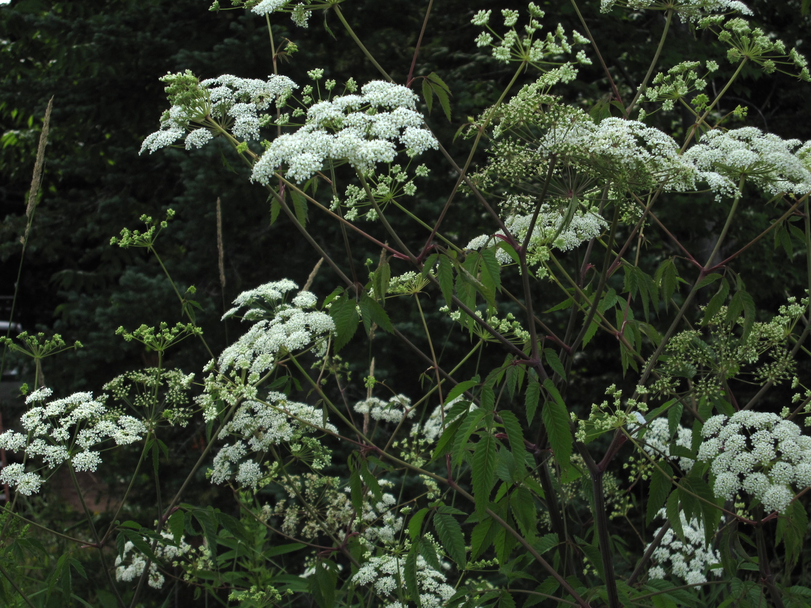
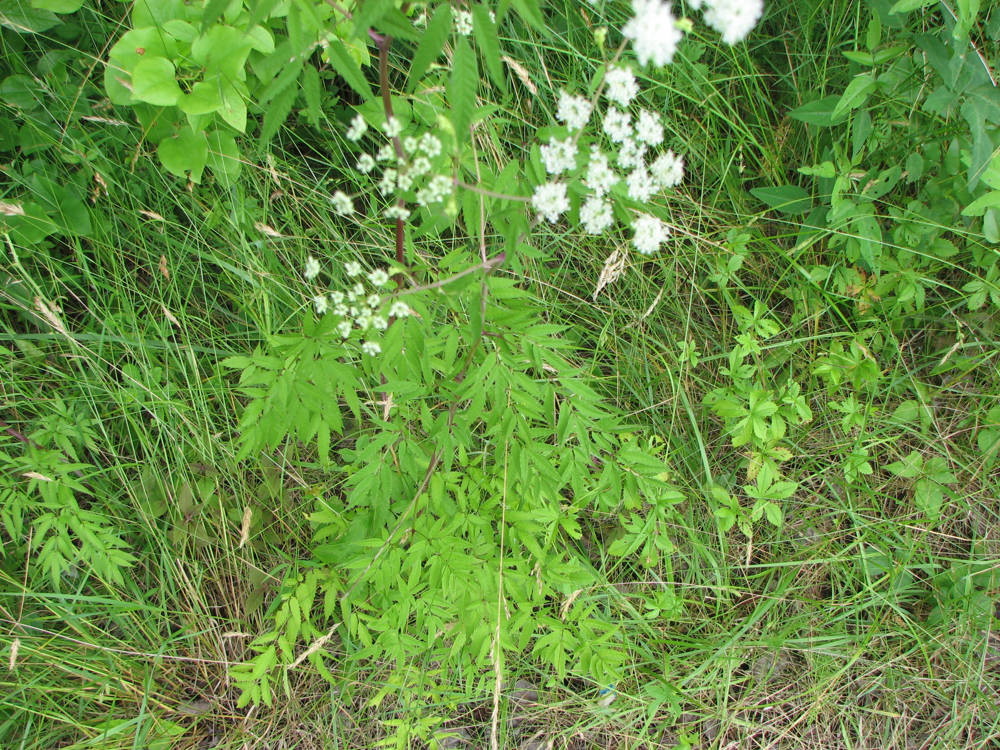

# 水芹毒 | Water Hemlock | *Cicuta maculata*

| 属性 | 内容 |
|------|------|
| 中文名 | 水芹毒 |
| 英文名 | Water Hemlock |
| 学名 | *Cicuta maculata* |
| 分类 | 不可食用 |
| 可食部位/毒部位 | 可食部位: 未知 |
| 关键特征 |  |
| 种植难度 |  |

## 1. 形态与识别要点

*水芹毒整株植物，生长在湿地环境中*

水芹毒（Cicuta maculata）是北美最危险的有毒植物之一，为伞形科毒芹属多年生草本植物。植株高大，可达1.8-2.5米，具有粗壮的中空茎杆，表面光滑，常有紫红色斑点或条纹。叶片为2-3回羽状复叶，小叶披针形，边缘具尖锐锯齿，叶脉清晰。

*水芹毒叶片特写，显示其羽状复叶和锯齿边缘*

花序为复伞形花序，由多个小伞形花序组成，白色小花密集。最危险的部分是其粗大的地下根茎，外观似防风或萝卜，但含有极高浓度的毒素环萜醇（cicutoxin）。

*水芹毒白色伞形花序*

*水芹毒的危险根茎，含有极高毒性的环萜醇*

### 与相似种的区别

水芹毒常与可食用的水芹混淆，但有几个关键区别：
1. **生长环境**：水芹毒主要生长在湿地、沼泽边缘
2. **茎杆特征**：水芹毒茎杆更粗大，常有紫色斑点
3. **根部形态**：水芹毒根茎粗大似萝卜，而安全水芹根系较细
4. **叶片细节**：水芹毒叶片锯齿更尖锐，叶脉更明显
5. **气味**：水芹毒切开后有刺鼻气味，而水芹有清香味

## 2. 种植技巧

- **气候区域**: USDA zones 4-9, 耐寒性强
- **光照需求**: 全日照至半阴，适应性强
- **土壤要求**: 湿润至水生环境，喜富含有机质的土壤
- **pH值**: 6.0-8.0，对土壤酸碱度要求不严
- **浇水**: 需要持续湿润或水生环境
- **施肥**: 
- **繁殖方式**: 种子繁殖, 根茎分株, 自然传播能力强
- **病虫害防治**: 很少受病虫害侵扰, 毒性成分天然防御
- **伴生建议**: 湿地植物, 常与其他水生植物混生

## 3. 常见品种

## 4. 化学成分与风味

## 5. 用法与搭配（仅可食用类）

### 保存方法

## 6. 毒理与禁忌

水芹毒的毒理学研究揭示了其独特而极其危险的毒性特征，使其成为植物毒理学研究的重要模型。水芹毒含有的聚乙炔化合物代表了植物次生代谢产物中一个特殊的化学类群。主要毒性成分分析：1）水芹毒素（cicutoxin）：分子式C17H22O2，分子量258.35，是一种含有三个三键的长链不饱和醇。其化学名称为17-氧-桂皮酰胺-8,10,12-三炔，具有高度的化学不稳定性，容易被光照和热分解。水芹毒素的毒性极强，小鼠腹腔注射LD50为2.5mg/kg，口服LD50约为10mg/kg。2）水芹毒醇（cicutol）：分子式C17H24O2，是水芹毒素的还原产物，毒性略低于水芹毒素但仍然极其危险。3）其他聚乙炔化合物：包括异水芹毒素（isocicutoxin）、水芹毒烯酸（cicutonic acid）等多种同系物，这些化合物的结构相似但毒性有所差异。毒理机制研究表明，这些聚乙炔化合物的毒性作用机制极其复杂：首先，它们能够直接结合并阻断神经细胞膜上的延迟整流钾通道（delayed rectifier K+ channels），导致神经元膜持续去极化；其次，抑制GABA能神经元的功能，消除大脑皮质的正常抑制作用；再次，影响钠离子通道的快速失活过程，使神经元产生异常的重复放电；最后，干扰细胞膜的磷脂双分子层结构，改变膜的通透性和稳定性。这些作用综合导致大脑皮质和脑干网状结构的异常电活动，表现为全面性强直-阵挛性癫痫发作。药代动力学特征：口服后10-30分钟开始被胃肠道吸收，60-90分钟达到血药浓度峰值；毒素主要分布在富含脂质的组织中，特别是脑组织；在肝脏经细胞色素P450酶系代谢，主要产物为无毒的羧酸化合物；消除半衰期2-6小时，但毒性作用可持续12-24小时。致死剂量研究：成人推算致死剂量为2-5mg/kg体重的水芹毒素，相当于误食2-3g新鲜根茎；儿童致死剂量更低，约0.5-1mg/kg体重。中毒的病理生理学变化包括：持续性癫痫发作导致的脑缺氧和脑水肿；呼吸肌持续收缩导致的呼吸衰竭；心肌异常兴奋导致的心律失常；横纹肌溶解导致的急性肾衰竭；持续高热和代谢性酸中毒。

## 7. 参考资料

- [Virol toxins, a group of polyacetylenes from water hemlock](https://www.jstage.jst.go.jp/article/cpb1958/48/10/48_10_1514/_article) — Chemical and Pharmaceutical Bulletin, 2000
- [Cicutoxin poisoning (water hemlock)](https://n.neurology.org/content/25/8/730) — Neurology, 1975
- Water Hemlock Poisoning in Livestock — Veterinary Clinics of North America: Food Animal Practice, 1999
- [North American Toxic Plants](https://www.wiley.com/en-us/Toxic+Plants+of+North+America%2C+2nd+Edition-p-9780813827049) — Iowa State University Press, 2013
- Cicutoxin: isolation and structure elucidation — Tetrahedron, 1953

---
*声明：本信息仅供参考，不替代专业医疗建议。*

## Local Image Gallery

*Downloaded high-resolution images for offline viewing:*

*Image 1: © Williammehlhorn at English Wikipedia (Public domain)*

*Image 2: © Choess (CC BY-SA 3.0)*

*Image 3: © Fritzflohrreynolds (CC BY-SA 3.0)*

*Image 4: © Joshua Mayer from Madison, WI, USA (CC BY-SA 2.0)*

